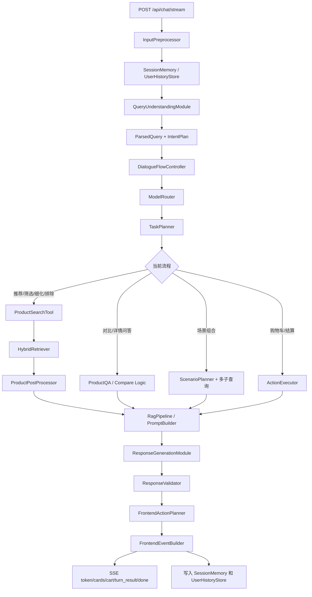

# 后端 Agent 系统设计文档

本文档是当前后端的最新系统设计说明，面向比赛答辩、后端开发交接和前端理解整体流程。它描述的是已经落地的版本：Doubao 优先的复杂意图识别、IntentPlan 多动作执行、商品 RAG、多轮状态、购物车工具、深度个性化上下文、图片+文本多模态第一版、前端三段式输出和本地用户历史。

## 1. 系统定位

本项目后端是一个基于 RAG 的多轮电商导购 Agent。它的目标不是普通聊天，而是通过自然语言帮助用户完成“表达需求 -> 补充偏好 -> 检索真实商品 -> 对比决策 -> 加购/结算”的闭环。

当前版本重点支持：

- 文本对话；
- 商品 RAG 检索与筛选；
- 多轮需求继承和主题锁定；
- 复杂组合意图拆解；
- 购物车和下单工具调用；
- 本地短期记忆、本地历史和长期用户画像；
- SSE 流式回复；
- 前端动作列表 + 前端数据 + 系统调试信息三段式输出。
- 深度个性化回复 prompt；
- 图片 + 文本输入的多模态查询融合；
- progress events，避免前端等待空转；
- 每轮运行耗时统计，用于定位性能瓶颈；
- 购物车侧个性化推荐，根据购物车商品共性影响新商品排序；
- 商品增强字段参与 query enhancement、召回、重排、推荐理由、比较和详情问答。

必须遵守的底线：

- 推荐商品只能来自 `/Users/grsxsa/2026 Spring/ECOMMERCE-GUIDER-main/ecommerce_agent_dataset`；
- 不允许编造商品、价格、库存、品牌、优惠、成分和功能；
- 用户可见回复不能出现 `RAG`、`memory`、`状态机`、`trace`、`IntentPlan` 等内部工程词；
- 购物车和下单动作必须由后端工具执行，大模型不能口头伪造购物车状态；
- 只有用户明确要求查看详情、查看购物车、结算/付款时，才向前端发送页面跳转动作。

## 0. 2026-06-01 最新增量设计

本节记录当前最新实现，便于和旧版文档区分。

### 0.1 Progress Events

新增 `ProgressEventBuilder`。在正式结果返回前，系统会根据当前意图、流程、是否需要 memory、是否需要 retrieval、是否需要 Doubao 和预计耗时等级，选择一组面向前端的进度文案。

典型进度：

- 已经理解您的需求，正在整理关键信息；
- 正在查找目标商品；
- 正在挑选更合适的商品；
- 正在组织回复。

原则：

- progress 是用户等待态，不是推理链；
- 不暴露内部 prompt、模型思考或检索细节；
- 正式 `turn_result` 返回后，前端停止 progress。

### 0.2 运行耗时统计

每轮对话会记录轻量级计时信息，写入 `system_debug.运行耗时统计`。

覆盖模块：

- memory 读取；
- 意图理解；
- IntentPlan 执行；
- RAG 检索；
- 商品后处理；
- 购物车侧个性化；
- prompt 构造；
- Doubao 调用；
- response validation；
- frontend events 构造；
- history 保存。

输出包括：

- 总耗时；
- 模块耗时列表；
- 模型调用次数和耗时；
- 最耗时 Top 模块。

### 0.3 购物车侧个性化

新增 `CartAwarePersonalization`。它不替代用户画像，而是从“当前购物车商品”抽象出商品侧偏好。

本地规则优先：

- `apple_macbook_ecosystem`：MacBook / Apple 生态 -> iPad、AirPods、同生态数码；
- `phone_audio_ecosystem`：手机 -> 真无线耳机、平板、同品牌生态；
- `training_apparel_to_shoes`：训练/速干服饰 -> 跑步鞋、运动帽、轻量透气装备；
- `premium_skincare_routine`：高端护肤核心单品 -> 面霜、眼霜、精华、修护保湿链路；
- `outdoor_travel_bundle`：户外/旅行商品 -> 防晒、帽子、背包、速干、轻量商品。

约束：

- 当前用户本轮明确需求是硬约束；
- 购物车画像只是软约束；
- 如果用户明确说“运动帽”，系统必须推荐帽子，不能因为购物车里有训练服就拉回跑鞋；
- 本地规则无法覆盖且场景复杂时，才调用 Doubao 输出结构化购物车画像。

### 0.4 商品增强字段

商品库新增六类增强字段，并已被后端真实使用：

- `product_highlight`
- `highlight_short`
- `highlight_detail`
- `suitable_scenarios`
- `target_user_tags`
- `non_standard_query_tags`

使用位置：

- 商品仓库读取；
- searchable text；
- RAG document；
- query enhancement；
- hybrid retrieval；
- rerank；
- 商品卡片理由；
- LLM verified facts；
- 商品比较；
- 商品详情问答；
- `system_debug.商品增强字段使用`。

典型非标准问题：

- “皮肤有点干，不想黏腻” -> 补水保湿、屏障修护、清爽肤感；
- “适合记笔记、追剧的平板” -> 平板学习/影音标签；
- “健身入门” -> 训练、透气、入门装备；
- “送朋友” -> 礼盒、分享、送礼标签。

### 0.5 三类历史用户测试

当前 `storage/user_history/` 中有三类历史用户：

- `sophia_digital`：数码小白女生，购物车里有 iPhone 和 MacBook；
- `alex_sports`：健身达人男生，购物车里有训练服和运动裤；
- `victoria_beauty`：美妆专家女士，购物车里有高端精华和化妆水。

专项测试脚本：

```bash
cd "/Users/grsxsa/2026 Spring/ECOMMERCE-GUIDER-main/backend"
USE_MOCK_LLM=1 python3 scripts/agent_console.py --mode old_user --user_id sophia_digital --session_id sophia_digital_check "我想再配一个适合现在购物车的数码产品"
USE_MOCK_LLM=1 python3 scripts/agent_console.py --mode old_user --user_id alex_sports --session_id alex_sports_check "我想再配一个适合训练用的装备"
USE_MOCK_LLM=1 python3 scripts/agent_console.py --mode old_user --user_id victoria_beauty --session_id victoria_beauty_check "我想再加一件适合现在护肤步骤的产品"
```

统一脚本会展示历史恢复、购物车共性分析、本地规则命中、商品增强字段命中、推荐结果和耗时摘要。

## 2. 总体架构



## 3. 核心模块与职责

### 3.1 API 层

路径：

- `backend/app/api/router.py`
- `backend/app/api/routes/chat.py`
- `backend/app/api/routes/products.py`
- `backend/app/api/routes/cart.py`
- `backend/app/api/routes/session.py`
- `backend/app/api/routes/health.py`

核心职责：

- 提供 `POST /api/chat/stream` 主对话 SSE 接口；
- 提供商品列表、商品详情、购物车 CRUD、状态调试接口；
- 把用户请求转交给 `ShoppingAgent.stream_chat(...)`；
- 将 Agent 事件转成 SSE。

### 3.2 Agent 编排层

核心文件：`backend/app/agents/shopping_agent.py`

核心函数：

- `stream_chat(...)`：每轮对话主入口；
- `_retrieve_for_flow(...)`：推荐、筛选、细化、排除流程检索；
- `_retrieve_scene_candidates(...)`：场景组合检索；
- `_execute_intent_plan(...)`：全部为工具动作的多步骤执行；
- `_execute_tool_steps_from_intent_plan(...)`：工具动作 + 检索动作混合执行；
- `_apply_retrieval_step_to_query(...)`：复杂意图中切换到最后一个检索目标；
- `_record_turn(...)`：保存本轮历史、trace 和 memory。

设计重点：

- 单轮输入可以包含多个动作，例如“加入购物车 -> 删除其他商品 -> 再推荐背包”；
- 工具动作按 IntentPlan 顺序执行；
- 如果同一句中既有工具动作又有新推荐需求，先执行工具，再做新商品检索；
- 对“其他的删掉”这类表达会保护本句刚刚加入的商品，避免误删。

### 3.3 输入预处理

核心文件：`backend/app/agents/input_preprocessor.py`

职责：

- 清洗空白和重复输入；
- 识别空输入、简单问候、明显偏题；
- 支持 `input_type=text` 和 `input_type=image_text`；
- 从 `metadata.image_path/image_url/image_base64` 读取图片输入，图片缺失或不可识别时不会让系统崩溃。

### 3.4 意图理解与 IntentPlan

核心文件：`backend/app/agents/query_understanding.py`

核心结构：

- `ParsedQuery`：本轮用户需求的结构化结果；
- `IntentPlan`：本轮要执行的一个或多个动作；
- `IntentStep`：IntentPlan 中的单个可执行步骤。

当前策略是“极少量严格模板 + Doubao 结构化规划”：

| 情况 | 处理方式 |
| --- | --- |
| `推荐xxx商品`、`想要xxx商品`、`选择一款xx`、`预算是xx` 这种低风险、含义单一表达 | 本地严格模板解析 |
| 多动作组合、模糊表达、省略句、反选、购物车、结算、对比、详情、场景化、上下文追问 | Doubao 输出结构化 IntentPlan |
| Doubao 不可用 | 保守规则降级，trace 中标记 `llm_failed_rule_fallback` |

IntentPlan 示例：

```json
{
  "primary_intent": "refine",
  "is_multi_intent": true,
  "resolution_source": "doubao",
  "steps": [
    {
      "step": 1,
      "intent": "cart_add",
      "source_text": "把你推荐的第一个防晒乳加到购物车",
      "target_ref": "第一个",
      "requires_tool": true,
      "requires_retrieval": false
    },
    {
      "step": 2,
      "intent": "cart_remove",
      "source_text": "把购物车中其他的防晒乳全部删掉",
      "requires_tool": true,
      "requires_retrieval": false
    },
    {
      "step": 3,
      "intent": "refine",
      "source_text": "再给我推荐一个200块左右的背包，也是旅游使用的",
      "requires_tool": false,
      "requires_retrieval": true
    }
  ]
}
```

### 3.5 对话状态机

核心文件：`backend/app/agents/dialogue_flow.py`

当前流程：

| 流程 | 说明 |
| --- | --- |
| `greeting` | 问候 |
| `recommendation` | 初始商品推荐 |
| `filtering` | 明确条件筛选 |
| `refinement` | 多轮补充偏好或预算 |
| `exclusion` | 反选、排除成分/品牌/款式 |
| `comparison` | 多商品对比 |
| `product_qa` / `detail` | 商品详情和商品问答 |
| `scene_bundle` | 场景化组合方案 |
| `cart_action` | 购物车增删改查 |
| `checkout` | 模拟结算下单 |
| `preference_update` | 明确长期偏好写入候选 |
| `clarification` | 信息不足时澄清 |
| `no_result` | 没有完全匹配商品 |
| `chitchat` / `out_of_scope` | 闲聊或非导购问题 |

主题锁定规则：

- 用户已经在看手机时，说“拍照好看、别太贵、再便宜点”应继续锁定 `数码电子/智能手机`；
- 用户明确说“重新挑选一款背包”才切换到 `服饰运动/背包`；
- 单品请求不会因为出现“旅行、通勤、海边”等场景词就误扩展成组合推荐；
- 只有“一套、全套、清单、方案、搭配、组合、配齐”等明显组合词才进入 `scene_bundle`。

### 3.6 模型路由

核心文件：`backend/app/agents/model_router.py`

当前原则：

- Doubao 是复杂意图、复杂决策和最终回复生成的主要能力；
- 本地规则只用于确定性、低风险、可解释的操作；
- 本地小模型用于商品召回和重排，不直接决定业务动作；
- 工具动作由后端执行，不交给大模型自由执行。

环境变量含义：

| 变量 | 默认建议 | 说明 |
| --- | --- | --- |
| `USE_MOCK_LLM=0` | 正式测试使用 | `false` 表示真实调用 Doubao；`true` 仅用于离线快速跑流程 |
| `ENABLE_LOCAL_MODELS=true` | 正式测试使用 | 是否加载 BGE/text2vec/reranker |
| `DOUBAO_API_KEY` | 正式测试必填 | Doubao API Key，不要写入文档或提交仓库 |
| `DOUBAO_BASE_URL` | `https://ark.cn-beijing.volces.com/api/v3/` | Doubao 兼容 OpenAI chat completions 接口 |
| `DOUBAO_MODEL` | 当前项目模型 id | 比赛使用的 Doubao endpoint |

### 3.7 商品检索与 RAG

核心文件：

- `backend/app/tools/product_search_tool.py`
- `backend/app/retrieval/hybrid_retriever.py`
- `backend/app/retrieval/post_processor.py`
- `backend/app/retrieval/document_builder.py`
- `backend/app/rag/pipeline.py`
- `backend/app/rag/prompt_builder.py`
- `backend/app/rag/knowledge_formatter.py`

检索流程：

1. 从 `ParsedQuery` 得到类目、子类目、价格、品牌、正向偏好、否定约束；
2. 类目、价格、品牌排除、否定条件优先作为硬约束；
3. 关键词、字符相似度、BGE embedding、text2vec embedding 进行召回；
4. BGE reranker 和约束分进行重排序；
5. `ProductPostProcessor` 去重、过滤、排序、生成自然推荐理由；
6. 只把最终候选商品事实交给 Doubao 生成回复。

评分摘要包含：

- `keyword`
- `semantic`
- `lexical_semantic`
- `bge_embedding`
- `text2vec_embedding`
- `bge_reranker`
- `constraint`
- `preference`
- `price_fit`

如果分数低于 `0.5` 但仍作为备选，回复会说明“不是完全贴合，但可以作为备选参考”。

### 3.8 回复生成与防幻觉

核心文件：

- `backend/app/agents/response_generator.py`
- `backend/app/agents/response_validator.py`
- `backend/app/rag/prompt_builder.py`

Doubao 回复生成边界：

- 可以组织语言、解释推荐理由、做对比、做场景化方案；
- 只能使用后端传入的 verified product facts；
- 不允许新增商品、改价格、改库存、编造优惠；
- 当前需求是硬约束，用户画像是软约束；
- 回复语气要求温柔、自然、有礼貌，像客服女士；
- 商品卡片推荐理由必须是一句完整的话。

校验：

- `ResponseValidator` 检查商品名、价格和候选集；
- 如果大模型输出越界，回退到本地 grounded 模板；
- 工具执行消息会被保留，避免“清空购物车后又被回复改写掉”。

### 3.9 Memory、历史和用户画像

核心文件：

- `backend/app/memory/session_memory.py`
- `backend/app/memory/user_history_store.py`
- `backend/app/memory/user_profile_service.py`
- `backend/app/memory/preference_manager.py`

短期记忆保存：

- 最近对话；
- 当前流程、意图、类目、子类目；
- 当前约束；
- 最近推荐商品；
- 最近候选商品；
- 购物车；
- 最近 trace；
- 可解析指代对象。

长期历史保存到：

```text
storage/user_history/{user_id}
```

长期用户画像包括：

- 说话风格；
- 价格偏好；
- 类目偏好；
- 品牌偏好和排斥；
- 功能关注点；
- 决策风格；
- 客服交互偏好；
- 明确长期偏好。

写入规则：

- “这次不要酒精”是当前约束，不写成长期偏好；
- “以后都不要酒精”“我一直不喜欢某品牌”才进入长期偏好候选；
- 不根据商品偏好推断敏感身份；
- 只有用户明确说“我是女生”“给爸爸买”“4岁小朋友”等，才作为用户自述或送礼对象信息。

### 3.10 Tool Calling

核心文件：

- `backend/app/tools/action_executor.py`
- `backend/app/tools/cart_tool.py`
- `backend/app/tools/checkout_tool.py`
- `backend/app/tools/order_tool.py`

支持工具动作：

| 动作 | 能力 |
| --- | --- |
| `cart_add` | 加入购物车，支持“第一款”“第二个”“刚才那个”和数量 |
| `cart_remove` | 删除指定商品、较贵/较便宜商品、某类商品 |
| `cart_update` | 修改数量 |
| `cart_clear` | 清空购物车 |
| `cart_view` | 查看购物车 |
| `cart_keep_only` | 只保留某类商品 |
| `checkout` | 用默认地址生成模拟订单 |

确定性原则：

- Doubao 只负责把自然语言拆成动作和参数；
- 实际加购、删除、清空、结算由后端工具操作真实 cart state；
- 每个工具执行结果写入 `frontend_data.cart_state` 和 `system_debug.工具执行`。

### 3.11 前端输出

核心文件：

- `backend/app/agents/frontend_action_planner.py`
- `backend/app/agents/frontend_event_builder.py`

每轮最终输出统一为：

```json
{
  "frontend_events": [],
  "frontend_data": {},
  "system_debug": {}
}
```

`frontend_events` 只描述前端动作，按顺序执行；`frontend_data` 放动作需要的数据；`system_debug` 只给后端和测试观察。

当前事件类型：

- `show_reply`
- `show_products`
- `show_product_detail`
- `navigate`
- `update_cart`
- `update_page_state`
- `show_clarification_options`
- `show_error`

页面跳转策略：

- 普通推荐：不跳转；
- 普通加购：不跳转；
- 明确“查看第 x 款详情”：跳 `product_detail_page`；
- 明确“查看购物车”：跳 `cart_page`；
- 明确“结算/下单/付款”：跳 `checkout_page`。

### 3.12 深度个性化回复

核心文件：

- `backend/app/memory/personalization_service.py`
- `backend/app/rag/prompt_builder.py`
- `backend/app/agents/response_generator.py`

当前实现：

- 从 `UserHistoryStore` 读取最近历史对话；
- 按当前类目、子类目、意图、价格、功能词、购物车变化选择相关历史证据；
- 自动构造 1-3 个 few-shot 示例；
- 加入相似人群/相似购买场景参考，例如儿童饮品、职场通勤、数码参数、价格敏感等；
- 新增相似历史用户协同过滤：当当前用户历史轮次超过 4 轮或已有稳定画像时，系统会扫描 `storage/user_history` 中的历史用户，优先比较 `alex_sports`、`xiaomei_beauty`、`lily_beauty_pro`、`xiaoming_digital`、`zhanggong_digital`、`xiaoya_clothing`、`daliu_sports`、`xiaochihuo_food`、`wangjingli_food` 等构造用户。匹配方法是本地 text2vec/BGE 语义相似度 + 关键词 fallback + 类目偏好重合；结果只用于回复风格、解释粒度和 few-shot 节奏参考，不改变商品事实和当前硬约束；
- 新增领域导购风格：美妆护肤使用温柔细腻的护肤导购风格，数码电子使用清晰理性的数码导购风格，服饰运动强调场景和搭配，食品饮料强调口味、规格、甜度和分享场景；
- 生成个性化策略，例如“先给结论，再给价格和场景理由”；
- 将个性化上下文传入 Doubao prompt，但不在用户回复中直接暴露“用户画像”。

`system_debug` 新增：

- `个性化分析.是否启用个性化`
- `使用的用户画像摘要`
- `本轮选中的历史证据`
- `本轮使用的few-shot示例`
- `相似人群参考`
- `领域导购风格`
- `相似历史用户协同过滤`
- `个性化生成策略`
- `用户画像更新`

### 3.13 图片 + 文本多模态第一版

核心文件：

- `backend/app/multimodal/image_loader.py`
- `backend/app/multimodal/image_preprocessor.py`
- `backend/app/multimodal/vision_analyzer.py`
- `backend/app/multimodal/visual_query_builder.py`
- `backend/app/multimodal/visual_retriever.py`
- `backend/app/multimodal/multimodal_service.py`
- `backend/scripts/agent_console.py`

当前实现：

- `POST /api/chat/stream` 支持 `input_type=image_text`；
- 图片来源支持 `metadata.image_path`、`metadata.image_url`、`metadata.image_base64`；
- 有可用视觉模型时尝试调用 LLM/VLM 进行图片属性分析；
- 视觉模型不可用时，使用文件名和用户文本做保守降级分析，保证 Demo 稳定；
- 图片理解结果会提取主要商品类别、候选类别、颜色、款式、场景和相似检索关键词；
- `VisualQueryBuilder` 将图片属性和文本需求融合成检索查询；
- 当前库存覆盖时进入现有 RAG 检索，例如背包、鞋子、帽子、防晒、耳机、饮料；
- 当前库存不覆盖时如实说明，例如连衣裙、毛绒玩偶，不编造商品。

`system_debug` 新增：

- `多模态分析.图片输入`
- `图片理解结果`
- `图文融合查询`
- `库存匹配判断`

### 3.14 隐私保护与可选择个性化

核心文件：

- `backend/app/memory/user_history_store.py`
- `backend/app/memory/user_profile_service.py`
- `backend/app/memory/personalization_service.py`
- `backend/app/agents/shopping_agent.py`
- `backend/app/agents/frontend_event_builder.py`

当前已经实现三种用户可选模式：

| 模式 | 用户表达/metadata | 系统行为 |
| --- | --- | --- |
| 完整个性化 `full` | `开启个性化`，或 `metadata.privacy_mode=full` | 可以使用历史摘要、结构化画像、相关历史 evidence 和 few-shot，但当前需求永远优先。 |
| 隐私个性化 `semantic` | `开启隐私个性化，只用语义摘要`，或 `metadata.privacy_mode=semantic` | 不使用历史自然语言原文做个性化，只使用结构化语义计数、价格信号、类目/功能标签和记忆卡片。 |
| 关闭个性化 `off` | `关闭个性化推荐`，或 `metadata.privacy_mode=off` | 不读取历史偏好生成回复，只按本轮明确需求和商品库推荐。 |

还支持独立控制原文保存：

- `不要保存聊天` 或 `metadata.store_raw_history=false`：session history 中隐藏本轮原始输入和回复，只保留结构化摘要、商品、购物车和语义记忆；
- `可以保存聊天` 或 `metadata.store_raw_history=true`：恢复保存原始对话。

设计亮点：

- 隐私控制可以和购物需求同句出现，例如“开启隐私个性化，只用语义信息，然后推荐一款适合通勤的背包”。系统会先更新隐私设置，再继续推荐商品；
- 隐私关闭不是清空购物车，也不会影响商品 RAG 能力；
- `system_debug.隐私保护` 会显示当前模式，方便测试同学确认；
- 用户可见回复不会出现“向量”“语义记忆”“用户画像”等内部词。

### 3.15 层次记忆与短期到长期晋升

当前记忆不再只是“保存聊天记录”，而是分层管理：

| 层级 | 保存位置 | 作用 |
| --- | --- | --- |
| 短期会话记忆 | `SessionMemory` | 最近消息、当前主题、最近推荐、指代映射、购物车、trace。 |
| 本地 session history | `storage/user_history/{user_id}/sessions/*.json` | 每轮用户输入、系统回复、推荐商品、检索摘要、购物车变化、状态快照。 |
| 语义长期记忆 | `profile.json.semantic_memory` | 类目计数、功能偏好、排除偏好、价格信号、推荐/加购/购买 SKU 统计。 |
| 记忆卡片 | `profile.json.memory_cards` | 从多轮对话晋升出的偏好卡片，带 scope、confidence、evidence_count、source_turn_ids。 |
| 用户画像摘要 | `profile_summary_text/structured_profile` | Doubao 或语义模式生成的长期用户偏好摘要。 |

晋升规则：

- 每轮保存时从 `ParsedQuery`、推荐商品、购物车和工具调用中抽取稳定信号；
- 如果用户关闭个性化，则停止晋升；
- 如果用户开启隐私个性化，则只晋升语义标签，不把历史原文作为 evidence；
- “这次不要”优先作为当前约束；“我一直喜欢”“以后都不要”“记住”才会更强地进入长期偏好候选；
- 画像分析不推断未明确说明的敏感身份。

`system_debug.层次记忆` 会展示本轮是否产生晋升候选；完整长期结果可通过 `/api/session/{session_id}/profile?user_id=...` 查看。

## 4. 当前能处理的用户表达、需求和意图

### 4.1 简单推荐

- `推荐一款适合油皮的洗面奶`
- `推荐防晒霜`
- `想要一双轻一点的跑鞋`
- `选择一款拍照好的手机`
- `帮我看看性价比高的蓝牙耳机`

### 4.2 条件筛选

- `200元以下的蓝牙耳机有哪些`
- `预算5000以内，拍照好的手机`
- `50元以内一箱的早餐速食`
- `单价5元以内的发圈，批量买20个`
- `500以内轻一点的跑鞋`

### 4.3 多轮补充和追问

- `推荐一款手机` -> `拍照好一点` -> `价格4000以内`
- `刚才几款太贵了，换便宜点`
- `那你倒是告诉我哪些合适呀`
- `再清爽一点`
- `换一个适合通勤的`

### 4.4 反选和排除约束

- `推荐防晒霜，但我不要含酒精的，也不要日系品牌`
- `买夏季短袖，不要紧身款，不要大Logo印花，想要宽松基础款`
- `推荐眼线笔，不要防水款，也不要笔头过粗`
- `不要耐克，500以下轻一点的跑鞋`
- `不要太甜的饮料`

### 4.5 商品对比

- `第一款和第二款耳机哪个更适合学生`
- `这两款手机哪个拍照更好`
- `刚才对比的两款哪个更划算`
- `哪个更适合小朋友喝`
- `三个里面哪个最好吃`

### 4.6 商品详情和问答

- `查看第一款商品详情`
- `这款含酒精吗`
- `这个还有库存吗`
- `第二个适合通勤吗`
- `它有什么缺点`

### 4.7 场景化组合推荐

- `下周去西北自驾旅行，帮我搭配一套户外用品清单`
- `情侣一周短途海边度假，穿搭、护肤、随身好物全套搭配`
- `居家健身，搭配运动服饰和运动后补给的一整套方案`
- `职场新人入职，帮我搭配通勤穿搭和桌面好物`

库存未覆盖的商品会如实说明，不会编造。例如当前库没有帐篷、哑铃、防滑垫、办公文具、保温杯，就只能推荐相近真实商品或提示暂无。

### 4.8 购物车和下单

- `把第一款加入购物车`
- `把第一款和第二款耳机都加入购物车`
- `把现在推荐的第二个往购物车加6瓶`
- `刚才加购的防晒不要了`
- `清空购物车`
- `只留下零食和其他产品，然后结算`
- `删除较贵的那款再付款`
- `查看购物车`
- `下单吧，地址用默认的`

### 4.9 复杂组合意图

当前已支持把一句话拆成多个动作并按顺序执行：

- `刚才加购的防晒不要了，清空购物车，重新挑选一款适合通勤和旅行的背包`
  解析为：`cart_clear -> refine`

- `把第一款加入购物车，然后直接下单，用默认地址`
  解析为：`cart_add -> checkout`

- `帮我把你推荐的第一个防晒乳加到购物车，把购物车中其他的防晒乳全部删掉，再给我推荐一个200块左右的背包，也是旅游使用的`
  解析为：`cart_add -> cart_remove -> refine`

- `我不喜欢刚才加到购物车的那个饮料了，你帮我把现在推荐的第二个往购物车加6瓶吧`
  解析为：`cart_remove -> cart_add`

### 4.10 隐私和多模态表达

- `关闭个性化推荐，不要根据历史推荐`
  只更新隐私设置，后续不使用历史偏好生成回复。

- `开启隐私个性化，只用语义摘要，不要用原文历史`
  切换到语义个性化，只用结构化偏好，不用历史原文 few-shot。

- `不要保存聊天，开启隐私个性化，然后推荐一款性价比高的饮料`
  同句完成隐私设置和商品推荐，历史文件中隐藏原始输入/回复。

- `[上传背包图片] 有没有类似这种款式，但价格低一点的背包`
  使用图片理解 + 文本需求融合，推荐真实背包。

- `[上传毛绒玩偶图片] 找同款毛绒玩偶，要大号版本`
  当前库存不覆盖，应如实说明暂无，不返回编造商品卡片。

## 5. 已完成的重要优化

1. Doubao 优先的复杂 IntentPlan
   本地规则不再大范围猜测复杂口语表达，减少“清空购物车被识别成加购”的错误。

2. 主题锁定
   用户在手机主题下补充“拍照好看、别太贵”时不会跳到美妆护肤。

3. 单品和场景组合分离
   “通勤旅行背包”是背包推荐，不会扩展成防晒、T 恤、饮料组合。

4. 多动作按序执行
   先执行购物车工具，再执行新检索，系统调试中可以看到 Doubao 返回的 IntentPlan。

5. 硬约束优先
   价格、品牌排除、否定成分、款式排除优先过滤。

6. 库存 grounded
   场景组合也只能从真实库中选商品；没有的商品只说明暂无。

7. 前端动作收敛
   普通推荐、普通加购不主动跳页，减少用户体验干扰。

8. 调试输出压缩
   默认输出摘要；`/debug` 或 `/all` 才看完整 JSON。

9. 用户画像参与回复
   历史画像作为软约束进入 Doubao prompt，但不覆盖本轮明确需求。

10. 隐私可控个性化
    用户可以关闭个性化，或只使用语义化信息保留个性化体验，原文历史可选择不保存。

11. 层次记忆晋升
    短期会话会自动提炼成语义计数、价格信号、记忆卡片和画像摘要，便于长对话和会话恢复。

## 6. 后续升级计划

### 6.1 个性化继续增强

- 增加画像置信度、画像更新时间、画像证据来源；
- 区分本人购买、送礼对象、临时场景、长期偏好；
- 为“小白用户、参数党、儿童场景、价格敏感、职场通勤”等类型维护更丰富的 few-shot 库；
- 增加点击、收藏、停留、购买完成等前端行为回传，进一步优化 evidence selection。

### 6.2 多模态继续增强

当前第一版已经支持图片输入、视觉属性抽取、图文融合和库存不覆盖兜底。后续如果要做更准确的“找同款/相似款”，建议引入真正的视觉向量检索。

无 GPU 的高效本地化方案：

1. 商品图片离线预处理：用 `Pillow + imagehash` 提取感知哈希、主色、亮度、边缘密度；
2. 文本侧用已有 `bge-small-zh-v1.5` / `text2vec` 处理用户描述和商品文案；
3. 图片上传后先用轻量规则、文件名、OCR 和用户文本识别目标类目；
4. 对库存商品先按类目和文本 RAG 召回，再用主色/尺寸/款式标签做轻量重排；
5. 适合 MacBook CPU 运行，效果稳定但无法真正做到复杂街拍同款识别。

需要 GPU 或云端 VLM 的增强方案：

| 能力 | 可选模型/工具 | 作用 |
| --- | --- | --- |
| 图片描述 | Qwen2.5-VL、InternVL、Doubao Vision、BLIP2、Florence-2 | 识别图片主体、颜色、款式、材质、场景 |
| 图文向量检索 | Chinese-CLIP、OpenCLIP、BGE-VL 或 SigLIP | 把商品图和用户图映射到同一向量空间 |
| 目标检测/裁剪 | YOLOv8/YOLOv10、GroundingDINO、Florence-2 | 从街拍中裁剪连衣裙、鞋子、包等目标区域 |
| OCR | PaddleOCR | 识别包装、品牌、型号文字 |
| 图片存储 | 本地 `storage/uploads` 或对象存储 | 保存用户上传图片和处理结果 |

推荐升级路线：

1. 用 Chinese-CLIP/OpenCLIP 为商品图片建立离线向量索引；
2. 上传图片先做目标检测或裁剪，再做视觉 embedding；
3. 视觉召回候选和文本 RAG 候选融合重排；
4. 回复生成时明确区分“同款”和“相似风格”；
5. 如果图中商品不在库里，只推荐相似款，并说明库存暂无完全同款。

示例目标：

- `[上传街拍全身照] 我想要图中女生身上的同款连衣裙`
  识别：连衣裙、颜色、长度、版型、风格；检索服饰库。

- `[上传鞋子特写图] 想要这双老爹鞋，还要相似风格的其他款式`
  识别：鞋型、颜色、厚底、运动休闲；检索鞋类。

- `[上传儿童玩偶照片] 找同款毛绒玩偶，要大号版本`
  当前库存如果无玩偶，应如实说明暂无，并可返回无结果或相近类目建议。

### 6.3 工程可靠性

- 增加更多真实 Doubao IntentPlan 回归用例；
- 给 Doubao JSON 输出增加更严格 schema 校验；
- 增加商品全字段防幻觉校验；
- 增加 FAISS/Chroma 持久化向量库；
- 给前端生成 TypeScript/Kotlin schema；
- 增加点击、加购、详情浏览等行为回传，用于画像更新。
