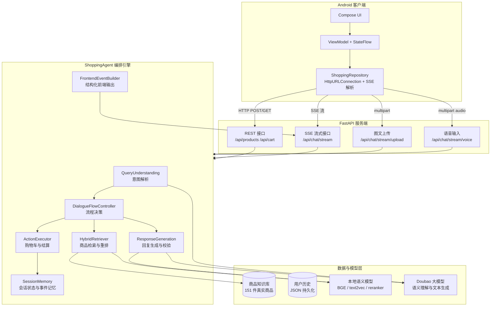
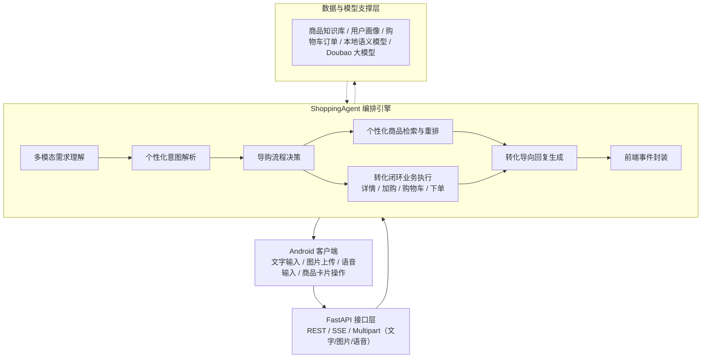
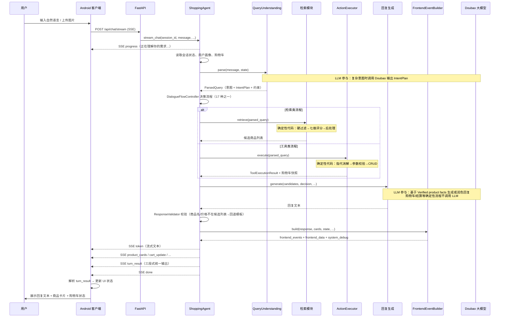

# 基于 RAG 的多模态电商智能导购 AI Agent 技术报告

## 1. 项目背景与需求分析

### 1.1 项目背景

传统电商的商品发现以搜索、筛选和推荐流为主。用户需要自行理解商品参数、比对品牌型号、判断卖点是否适合自身需求。当需求精确时（搜索已知型号的手机），这种模式是高效的；但当需求模糊时——"想买一款适合油皮的洗面奶"或"预算 300 元给女朋友挑个礼物"——传统搜索很难一次性匹配用户的隐含偏好和使用场景，用户往往需要多轮搜索、逐条浏览详情、自行归纳对比，认知成本较高。

大语言模型（LLM）和检索增强生成（RAG）技术的发展，为电商导购提供了从"被动展示"转向"交互式导购"的技术基础。但简单的"RAG 检索 + LLM 回复"模式在实际导购场景中面临几个根本性挑战：LLM 可能编造不存在的商品信息；检索结果缺乏个性化排序；推荐到购买的链路在对话界面中断裂；多轮交互中的上下文和指代关系容易丢失。

本项目设计并实现了一个面向电商导购场景的结构化 AI Agent 系统，将导购能力拆解为需求理解、流程控制、任务规划、商品检索、约束过滤、记忆管理、个性化建模、工具执行、前端动作生成与多轮对话反馈等多个可控模块，并通过这些模块的协同实现端到端导购闭环。系统以 `ecommerce_agent_dataset` 中经过结构化增强的 151 件真实商品数据为事实基础，结合本地 BGE/text2vec/reranker 模型完成商品召回、语义匹配与候选排序；Doubao 大模型在受约束的上下文中承担复杂意图规划与自然语言表达生成。系统的核心能力来自内部 Agent 架构对"理解—检索—决策—执行—生成—反馈"全过程的精细化组织，个性化推荐、多轮指代解析、商品比较、购物车操作、模拟下单和前端可交互展示等导购功能均由后端确定性模块执行，并经过统一校验，保证推荐可信和动作可控。

### 1.2 行业痛点与设计回应

| 痛点 | 具体表现 | 本项目的设计回应 |
|------|---------|-------------|
| 用户需求表达模糊 | 用户常用自然语言描述而非精确搜索词 | 意图识别 + IntentPlan 多步规划 + 多轮追问补全 |
| 大模型生成不可控 | LLM 可能凭空编造商品名、价格、功效参数 | Verified product facts 事实隔离 + ResponseValidator 校验 |
| 个性化需求难以用固定规则覆盖 | 同一类商品，不同用户关注维度差异很大 | 五层分层个性化：硬约束/画像软约束/购物车侧/领域风格/隐私控制 |
| 推荐到购买的链路断裂 | 传统 Agent 只能推荐，用户需离开对话去手动加购下单 | 对话式购物车工具调用 + 前端结构化事件同步 + 闭环结算引导 |
| 多轮交互中上下文容易丢失 | 难以处理"第一款""刚才那个""便宜点的"等指代追问 | 事件记忆 + rank_to_sku 映射 + 五层指代消解 |

### 1.3 核心设计理念与主要贡献

本系统不是一个普通的"RAG 检索 + LLM 回复"问答系统，而是一个面向电商导购闭环的结构化、可控 AI Agent。其核心设计理念围绕以下三条主线展开。

#### 1.3.1 MAS-to-SAS Skill-Compiled Shopping Agent

传统多智能体导购系统（MAS）通常将意图识别、检索规划、记忆分析、商品比较、购物车操作和回复生成拆分为多个独立的 LLM Agent 协同完成。这种架构虽然模块边界清晰，但多 Agent 之间通过自然语言串行通信会带来重复上下文传递、API 调用延迟高、Token 消耗大和跨 Agent 状态不一致等问题。

本系统采用 **MAS-to-SAS（Multi-Agent System to Single-Agent System）compilation** 思想：保留传统 MAS 中各个能力维度的模块化边界，但将这些能力组织到一个中心 `ShoppingAgent` 内部，由结构化能力模块、IntentPlan 任务计划和确定性工具协同承载。系统的 Agent 内部职责划分为三层：

1. **Capability Layer（能力层）**：将导购所需的全部语义和执行能力组织为结构化模块——需求理解（query understanding）、意图规划（intent planning）、对话状态跟踪（dialogue state tracking）、RAG 证据推理（RAG evidence reasoning）、记忆推理（memory reasoning）、购物车操作规划（cart action planning）、回复生成（response generation）和前端动作规划（frontend action planning）。这些模块通过依赖注入协作，由中心 Agent 统一调度。

2. **Deterministic Tool Layer（确定性工具层）**：所有涉及真实业务状态的操作由后端代码确定性执行，包括商品检索与硬约束过滤、召回重排、SKU 定位、购物车 CRUD、会话状态修改、输出校验和前端事件结构化封装。LLM 不直接产生这些操作的最终参数。

3. **Validation Layer（校验层）**：将商品知识库定义为 Agent 的事实边界。商品事实校验确保 LLM 回复中的商品名和价格不超出候选列表；动作参数校验确保购物车操作的 sku_id、数量等参数合法；状态一致性校验确保前端数据与后端状态同步；前后端边界控制确保后端运行痕迹不与前端用户数据混淆。

LLM 与确定性代码的职责边界如下：
- **LLM 负责**：复杂口语的语义理解、结构化 IntentPlan 的生成、基于商品事实的自然语言表达、用户画像分析和多模态视觉理解；
- **后端确定性代码负责**：商品检索与硬过滤、SKU 定位与指代消解、购物车 CRUD、状态修改、前端事件生成和所有校验环节。

对于简单请求（问候、越界、确认），系统由本地模板和规则快速响应，无需调用大模型；对于复杂、多意图、多轮上下文依赖的请求，Doubao 输出结构化 IntentPlan，后端按步骤执行，并对所有结果做确定性校验。这种设计保留了 MAS 的能力完整性，但避免了多个 LLM Agent 串行通信带来的延迟和上下文浪费。

#### 1.3.2 分层个性化与隐私控制

系统的个性化机制不是简单的 few-shot Prompt 构造，而是采用分层决策：当前轮用户明确表达的预算、类目、品牌和否定条件是硬约束，必须优先执行；用户画像、相似用户协同过滤、领域导购风格和购物车侧个性化是软约束，影响排序和解释重点，但不可覆盖本轮要求。

同时，系统支持 **full、semantic、off** 三种隐私模式。full 模式使用画像摘要和历史证据；semantic 模式只使用结构化语义计数，不引用历史自然语言原文；off 模式完全关闭个性化，仅依据当前需求推荐。三种模式可在对话中通过自然语言即时切换——个性化是增强，不是依赖。

#### 1.3.3 三层鲁棒性防护

系统在检索无结果、用户需求超出可用商品范围、模块工作异常等情况下不会直接失败，而是通过三层递进防护保持稳定输出：
- **检索层**：四级渐进式约束放宽（价格→子类目→否定条件→全库存关键词匹配），确保始终有真实备选商品；
- **导购层**：无精确匹配时主动给出相近备选和差异说明，引导用户调整需求方向，而非消极拒绝；
- **系统层**：全局异常安全网确保任何未捕获异常产生可用的兜底回复，不中断对话流。

#### 1.3.4 主要贡献

综上，本系统的主要贡献可概括为三项：

1. **中心化 Agent 编排**：将多 Agent 能力编译为中心 Agent 内部的结构化模块，由 IntentPlan 驱动、确定性工具执行、统一校验收束，在保持模块化的同时消除多 Agent 通信开销；
2. **分层个性化与隐私可控**：融合当前对话状态、长期用户画像、相关历史证据、购物车商品上下文和领域导购策略，分别作用于候选商品排序、推荐理由组织和回复表达，使相同需求能够根据用户偏好和当前购物场景产生差异化推荐；同时采用五层优先级机制（硬约束 > 画像软约束 > 购物车侧 > 领域风格 > 隐私模式）确保当前需求不被历史偏好覆盖，并结合三种隐私模式支持合规的个性化推荐；
3. **检索→导购→系统三级鲁棒性**：渐进放宽、备选引导和异常安全网三层机制保证系统在任何输入下都能给出恰当、诚实的回复。

### 1.4 项目目标

本项目的建设目标可以概括为：设计并实现一个**面向购买转化的、基于 RAG 的个性化电商智能导购 AI Agent**。它不是一个单纯的商品问答系统，而是一个将推荐、对比、加购、下单串联在对话流中的导购决策辅助系统。系统在以下三个方向上形成完整能力：

- **可信推荐**：以商品知识库为事实边界，通过硬约束过滤、七维混合检索和防幻觉校验，确保每一条推荐都基于真实商品数据；
- **个性化导购**：通过分层机制在硬约束优先的前提下融合用户画像、购物车上下文和领域风格，使推荐贴合不同用户的偏好和购买场景；
- **业务闭环**：将需求理解、商品推荐、指代消解、购物车操作和结算引导串联在同一对话流中，通过结构化前端事件驱动多页面状态同步。

---

## 2. 系统总体设计

### 2.1 系统总体架构

系统采用前后端分离架构，由 Android 客户端、FastAPI 服务端、ShoppingAgent 编排引擎以及数据与模型层四个工程部分组成。各部分通过 REST 接口和 SSE 流式连接协作。





**Android 客户端**：Kotlin + Jetpack Compose + MVVM 架构。`ShoppingRepository` 通过 `HttpURLConnection` 发起 REST 请求和 SSE 流连接，手动解析 SSE 事件流，将结果映射为 UI 状态。`ChatViewModel` 管理对话状态并通过 `StateFlow` 驱动 Compose UI 响应式更新。已接入聊天、商品详情、购物车、结算、订单结果、图片搜索和地址管理共 7 个页面。

**FastAPI 服务端**：对外暴露 REST 接口（商品列表/详情、购物车 CRUD、会话调试）和 SSE 流式接口（主对话 `/api/chat/stream`、图文上传 `/api/chat/stream/upload`、语音输入 `/api/chat/stream/voice`）。请求到达后由路由层分发给 `ShoppingAgent`，响应以 SSE 事件流形式逐步返回。语音接口经 ASR 转写为文本后进入同一 Agent 处理管线，可选附加 TTS 语音回复。

**ShoppingAgent 编排引擎**：系统的核心，注入 24 个协作组件，覆盖输入预处理、意图解析、流程决策、检索调度、工具执行、回复生成、前端事件构造、历史持久化、语音服务和画像刷新。各组件通过依赖注入协作，由中心 Agent 根据流程类型统一调度。用户画像刷新改为后台异步执行（每 3 轮触发），不阻塞当前回复。

**数据与模型层**：商品知识库提供 151 件真实商品的结构化数据（展示事实、过滤事实、检索事实和导购增强事实四组）；用户历史以 JSON 文件持久化；本地语义模型（BGE/text2vec/reranker）提供嵌入、分类和重排序能力；Doubao 大模型在受约束的上下文中完成意图解析和文本生成。

### 2.2 核心处理流程

一轮用户请求在系统中的完整处理流程如下。流程中明确标注了 LLM 参与环节和确定性代码执行环节。



流程中各步骤的 LLM 参与情况：

| 步骤 | 执行方式 | 说明 |
|------|---------|------|
| progress 事件推送 | 确定性代码 | ProgressEventBuilder 根据输入类型和用户状态预生成文案模板 |
| 会话状态读取 | 确定性代码 | SessionMemory 内存读取 |
| 意图解析 | LLM + 确定性代码 | 简单句式由严格模板本地完成（零 LLM）；复杂表达调用 Doubao 输出 IntentPlan |
| 流程决策 | 确定性代码 | DialogueFlowController 基于规则的状态机 |
| 商品检索 | 确定性代码 | 硬过滤、七维评分、后处理均由代码执行，不调用 LLM |
| 购物车操作 | 确定性代码 | ActionExecutor 执行，LLM 仅输出意图计划，不参与参数确定和执行 |
| 回复生成 | LLM + 本地模板 | 推荐/对比/场景方案等流程按 ModelRouter 决策调用 LLM；购物车/结算/澄清/闲聊等直接使用模板 |
| 回复校验 | 确定性代码 | ResponseValidator 比对商品名和价格，不匹配时回退模板 |
| 前端事件构造 | 确定性代码 | FrontendEventBuilder 将后端数据封装为三段式结构 |
| 用户画像刷新 | 后台线程（非阻塞） | 每 3 轮或会话结束时由 daemon 线程异步执行，不阻塞当前回复 |
| SSE 输出 | 确定性代码 | 事件序列化和流式推送 |

### 2.3 功能模块划分

后端核心模块按职责分组，各模块的代码入口和职责如下：

| 模块 | 代码入口 | 主要职责 |
|------|---------|---------|
| API 路由 | `app/api/router.py` | 聚合 `/chat`、`/products`、`/cart`、`/session` 四组路由 |
| ShoppingAgent | `app/agents/shopping_agent.py` | 中心编排入口，注入 24 个组件，串联全部处理环节。内置 `ProgressStageTimer` 和 `ProgressCompletionTracker`，为每个处理阶段记录真实耗时并发射 completing progress 事件 |
| QueryUnderstanding | `app/agents/query_understanding.py` | 三层递进意图解析（严格模板 → Doubao IntentPlan → 规则降级），输出 ParsedQuery |
| DialogueFlowController | `app/agents/dialogue_flow.py` | 将意图映射到 17 种业务流程，输出 FlowDecision |
| HybridRetriever | `app/retrieval/hybrid_retriever.py` | 七维混合评分（关键词 / n-gram / BGE / text2vec / 约束 / 标签 / 偏好 / reranker） |
| RetrievalFallback | `app/retrieval/fallback.py` | 四级渐进放宽（价格 → 子类目 → 否定约束 → 全库存关键词） |
| ProductPostProcessor | `app/retrieval/post_processor.py` | 去重、二次过滤、排序、生成 ProductCard |
| ProductRepository | `app/repositories/product_repository.py` | 加载 151 件商品、标准化、构建 searchable_text 和增强标签 |
| ActionExecutor | `app/tools/action_executor.py` | 购物车操作统一入口，7 种操作（加购/删除/修改/清空/查看/保留/下单） |
| OrderService | `app/services/order_service.py` | 模拟订单生成 |
| SessionMemory | `app/memory/session_memory.py` | 短期会话状态、事件记忆（rank_to_sku）、引用缓存 |
| UserHistoryStore | `app/memory/user_history_store.py` | 用户历史 JSON 持久化、隐私控制 |
| PersonalizationService | `app/memory/personalization_service.py` | 用户画像上下文、协同过滤参考 |
| CartAwarePersonalization | `app/memory/cart_aware_personalization.py` | 购物车侧个性化画像标签、配对规则、重排加分 |
| ResponseGeneration | `app/agents/response_generator.py` | 按流程分流：模板/LLM 润色/直接回传 |
| RagPipeline | `app/rag/pipeline.py` | Verified product facts 提取与 Grounded Prompt 构造 |
| ResponseValidator | `app/agents/response_validator.py` | LLM 回复事实校验，检测幻觉并回退模板 |
| MultimodalService | `app/multimodal/multimodal_service.py` | 视觉分析 + 图文融合查询 + 视觉商品匹配 |
| FrontendEventBuilder | `app/agents/frontend_event_builder.py` | 三段式输出（frontend_events + frontend_data + system_debug） |
| ProgressEventBuilder | `app/progress/progress_event_builder.py` | 处理早期推送进度文案 |
| ClosingGuide | `app/agents/closing_guide.py` | 加购后温引导结算（接受/拒绝检测 + 冷却） |
| SpeechService | `app/services/speech_service.py` | 语音识别（ASR）和语音合成（TTS），支持 auto/whisper/edgetts/macos-say 多后端切换 |
| LocalModelManager | `app/ml/local_models.py` | BGE/text2vec/reranker 本地模型加载和推理 |
| DoubaoClient | `app/llm/doubao_client.py` | Doubao API 调用（兼容 OpenAI chat/completions 协议） |

### 2.4 关键技术问题与解决思路

以下总览表建立了从业务痛点到技术方案的完整映射，详细设计见第 3～5 章。

| # | 问题 | 产生原因 | 解决方案 | 对应模块 | 详见 |
|---|------|---------|---------|---------|------|
| 1 | LLM 商品幻觉 | LLM 可能编造不存在的商品名和参数 | 商品知识库为事实边界 + Verified product facts 约束 Prompt + ResponseValidator 校验并回退 | ProductRepository, RagPipeline, ResponseValidator | §3.1, §3.4 |
| 2 | 多意图多动作输入 | 用户一句话含多个操作（加购+推荐） | IntentPlan 多步拆解 + `is_multi_intent` 标志 + 按序执行 steps | QueryUnderstanding, ShoppingAgent | §3.2 |
| 3 | 多轮商品指代 | 用户用"第一款""刚才那款"引用历史推荐 | 事件记忆 `rank_to_sku` + 五层回退解析 + 失败转澄清 | SessionMemory, ShoppingAgent | §4.1 |
| 4 | 购物车操作安全 | LLM 在指代消解上存在不确定性 | IntentPlan 出计划 → ActionExecutor 校验并执行 → 事件记忆写入 | ActionExecutor, CartService | §4.2 |
| 5 | 历史偏好与当前需求冲突 | 用户历史偏好可能与本轮约束矛盾 | 五层优先级：硬约束 > 画像 > 购物车侧 > 领域风格 > 隐私 | PersonalizationService, CartAwarePersonalization | §5.1 |
| 6 | 严格检索无结果 | 用户需求超出库存范围 | 四级渐进放宽 + 备选推荐 + 诚实说明差异 | RetrievalFallback, ProductPostProcessor | §3.3, §5.3 |
| 7 | 前后端状态不一致 | 前端从 LLM 回复文本解析数据 | frontend_events + frontend_data 结构化驱动，前端不解析文本 | FrontendEventBuilder | §4.3 |
| 8 | 长耗时等待 | LLM 调用需数秒，前端无反馈 | ProgressEventBuilder 提前推送进度文案，正式结果返回后替换 | ProgressEventBuilder | §4.3 |
| 9 | 多模态图文检索 | 图片内容无法用文本匹配 | Doubao 视觉分析 → 图文融合查询 → 视觉商品匹配 → 候选增强 | MultimodalService, VisionAnalyzer | §5.4 |
| 10 | 模型与模块异常 | API 不可用、模块故障 | 三层降级：IntentPlan 规则回退 + ResponseValidator 模板兜底 + 全局异常安全网 | QueryUnderstanding, ResponseValidator, ShoppingAgent | §5.3 |
| 11 | 语音输入场景 | 移动端需要免打字交互 | ASR 转写 + 同一 Agent 管线处理 + 可选 TTS 回复 | SpeechService, voice route, ChatViewModel（Android） | §5.4, §6.6 |

---

## 3. 核心导购链路设计

本章逐一展开商品知识库、意图解析、商品检索和回复生成四条核心链路，重点说明每一条链路中 LLM 的语义职责与后端确定性模块的执行边界。

### 3.1 商品知识库：Agent 的事实边界

商品知识库是系统可信推荐的根基。它的核心定位不是"商品列表"，而是**Agent 可以引用的事实边界**——LLM 只能基于知识库中存在的商品信息生成推荐理由，知识库中没有的商品字段对 LLM 完全不可见。

系统中 151 件商品覆盖美妆护肤、数码电子、服饰运动、食品饮料四个一级类目。原始 JSON 数据经 `ProductRepository` 标准化后，按 Agent 使用方式组织为四组事实：

**展示事实**（驱动前端渲染）：商品名称、品牌、价格（取多 SKU 最低价）、库存、图片 URL。这些字段直接映射到前端 `ProductCard` 组件，保证用户看到的商品信息来自真实数据。

**过滤事实**（驱动硬过滤）：类目、子类目、价格、品牌。在评分前由 `_hard_filter()` 使用——类目不匹配直接排除，价格越界直接排除，品牌被用户排除的直接排除。这些字段是硬约束，任何个性化信号都不能突破。

**检索事实**（驱动 RAG 召回）：`searchable_text` 字段在加载时由 `_build_searchable_text()` 将商品名、品牌、类目、SKU 属性、卖点摘要、营销描述、FAQ 问答、用户评价全部拼接为单一文本。所有检索路径——关键词命中、字符 n-gram 语义、BGE/text2vec 向量余弦——都在同一份 `searchable_text` 上执行，避免了多字段检索的权重分配问题。

**导购增强事实**（驱动个性化和推荐理由）：标签（`tags`，从文本中自动匹配 40+ 标签词表）、商品亮点（`highlight_short`/`highlight_detail`）、适用场景（`suitable_scenarios`）、目标人群标签（`target_user_tags`）、非标准查询标签（`non_standard_query_tags`）。这些结构化标签在检索的增强评分阶段（`_enhancement_score`）和回复生成阶段参与匹配，帮助系统理解"这款商品适合谁、在什么场景下使用"——例如用户说"通勤穿搭"，系统不仅匹配商品描述中的"通勤"文字，还会匹配标记了 `suitable_scenarios: ["通勤"]` 的商品。

此外，`reviews_summary`（自动聚合平均评分 + 提取好评/差评示例）作为风险字段，在 Prompt 中驱动 LLM 主动提示商品缺陷（如"部分用户反馈质地偏厚"），而不是只报喜不报忧。

### 3.2 用户理解与 IntentPlan

电商导购对话中，用户输入是高度自由的中文口语。一句话可能同时包含意图指令、商品类目、预算范围、品牌偏好和否定条件——"2000-4000 元、拍照好的 OPPO 或 vivo 手机，不要小米"——系统需要将其一次性解析为可执行的导购任务。

系统采用**三层递进解析架构**，按开销和精度从低到高排列：

**第一层：严格模板。** 仅处理少数低风险高置信句式（"推荐一款xxx""想要xxx""预算是xxx"），由正则匹配本地完成，零 LLM 开销。遇到任何复杂信号词（"不要""然后再""购物车""对比""同时"）立即拒绝并交给下一层。

**第二层：Doubao IntentPlan（主力层）。** 处理所有自由表达、多动作组合、反选排除和上下文追问。系统将可用类目树、当前会话状态（类目、约束、最近推荐列表、购物车内容）和 6 条执行规则发送给 Doubao，要求输出结构化 `IntentPlan`——包含 `primary_intent`、有序 `steps` 列表以及每步的 `intent`、`source_text`、`target_ref`、`quantity`、`sku_id`、`keep_categories` 等执行参数。

这里的关键设计边界是：**IntentPlan 描述"需要做什么"，而不是"直接执行"。** LLM 在这一层的职责是提供复杂语义理解和结构化规划能力——识别意图、拆解步骤、标注执行参数。但 IntentPlan 中的 `sku_id`（商品定位）、`quantity`（数量）、`keep_categories`（类目约束）等字段只是 LLM 基于上下文的初步推断；最终的 SKU 定位由事件记忆的指代消解完成，数量由参数校验确认，购物车状态和检索结果由后端确定性模块产生。LLM 不直接决定最终业务动作和状态变化。

**第三层：保守规则降级。** Doubao API 不可用时触发，使用信号词组匹配（覆盖 18 种意图的 120+ 信号词）、类目别名映射（180+ 条，涵盖洁面、防晒、底妆、电子书阅读器、移动硬盘、手机散热器、外套、瑜伽裤、健身补给等细分类目）、品牌别名和分组表、text2vec 语义分类等本地手段完成意图识别和约束提取，在 `route_source` 中标记降级来源。还维护 `virtual_sub_to_main` 映射表以支持虚拟子类目（如"底妆→美妆护肤""外套→服饰运动"）的正确路由。

所有路径的输出是统一的 `ParsedQuery`，包含意图与计划、类目与约束、操作与指代、场景与用户、上下文状态五个字段组。其中 `IntentPlan` 是核心产出物——它的 `steps` 列表按执行顺序排列，每个 step 带有 `requires_tool` 和 `requires_retrieval` 标志，ShoppingAgent 据此决定调用 ActionExecutor（工具执行）还是 ProductSearchTool（商品检索）。组合意图场景下（如"把第一款加购，然后结算"），多个步骤按顺序执行，前一步结果影响后一步行为。

意图解析完成后，`DialogueFlowController.decide()` 将 IntentPlan 中的主意图映射到 17 种业务流程之一——推荐、筛选、细化、对比、详情、场景方案、购物车操作、结算、澄清、闲聊、越界等——再交由 ShoppingAgent 的主分支执行对应处理路径。

### 3.3 商品检索、重排与容错

检索模块的核心任务是：在 151 件商品中，找到同时满足用户硬约束且在语义上与需求最匹配的候选商品。检索逻辑、评分计算和约束校验全部由后端代码执行，不依赖 LLM。

检索流程分为三步。第一步**硬过滤**：在评分前直接以类目、子类目、价格、品牌、否定约束为条件排除不合格商品。否定约束含安全词判断——例如用户要求"不要酒精"，但商品描述写有"不含酒精"，该商品不会被误排。被排除的商品标记 `filtered_out=True` 并保留在后段，以备后续放宽条件时重新启用。

第二步**多维评分**：每个商品独立计算七个维度的分数——关键词命中率（精确匹配）、字符 n-gram 语义相似度（无模型兜底）、BGE/text2vec 双向量余弦相似度（深层语义）、约束匹配分、商品增强标签匹配分（利用 3.1 节所述的适用场景/人群标签/非标准查询标签进行语义增强）、价格适配分、长期偏好分。当 reranker 可用时再加入交叉编码器重排序分。七个维度的信号互补，任一层不可用时其余层仍可独立工作。

第三步**后处理**：`ProductPostProcessor.finalize()` 按 `product_id` 去重（保留最高分）、二次校验类目/子类目/价格/品牌/否定约束、检测 `violated_constraints` 并排除，按分数排序取前 N 个（推荐取 3 个，对比取 5 个）。`build_product_cards()` 将候选转化为前端可渲染的 `ProductCard` 对象并生成推荐理由——高匹配商品生成正向推荐句，低匹配商品生成诚实提示句（"匹配度一般，作为备选"）。

**购物车侧重排。** 在检索完成之后、后处理之前，`CartAwarePersonalization.rerank()` 根据购物车中同类商品的品牌、子类目和标签，对候选商品进行加分重排。例如购物车有 MacBook 时，推荐耳机/平板会获得 +0.08 品牌搭配分；购物车有精华时，推荐同品牌面霜/眼霜获得 +0.12 子类搭配分。重排仅限同类目生效，购物车只有美妆商品时不影响数码类推荐。

**检索容错。** 当严格检索返回空时，`RetrievalFallback.progressive_retrieve()` 执行四级渐进放宽：放宽价格约束 → 放宽子类目约束 → 移除否定硬过滤 → 全库存关键词匹配。每步放宽容错记录在 `FallbackResult` 中，供回复生成时向用户诚实说明差异。这一设计确保"无精确匹配"也不会中断导购链路。

### 3.4 回复生成与防幻觉

检索返回的候选商品集只是一组带评分的结构化数据，距离用户可读的导购回复还需要经过四阶段流水线。这一流水线中 LLM 与确定性代码的职责分工为：**商品事实来自后端提取和校验，LLM 基于受约束的事实进行自然语言表达。**

**第一阶段——后处理**（3.3 节已述）：去重、二次过滤、排序、生成商品卡片和推荐理由。

**第二阶段——事实提取**：`RagPipeline` 通过 `KnowledgeFormatter` 从候选商品的 `rag_knowledge`、`reviews_summary`、`tags`、`spotlight` 中提取关键信息，格式化为 "Verified product facts" 文本块——只传递商品名称、价格、卖点摘要和关键评价，避免完整 JSON 撑大 Prompt。未检索到的商品字段对 LLM 完全不可见，从数据层面限制幻觉空间。

**第三阶段——生成**：`ResponseGenerationModule.generate()` 根据当前业务流程选择不同策略。购物车/结算类直接回传工具执行结果（不调用 LLM）；偏好更新/澄清/闲聊/越界使用本地模板；推荐/筛选/细化/排除类流程使用 `local_grounded_template` 模式——由后端将候选商品的结构化数据（商品名、价格、卖点、与用户需求的匹配点）直接填充到本地推荐模板中，不调用 LLM 生成回复文本。对比和场景方案等需要结构化文案编排的流程，先构造本地模板作为兜底，再根据 ModelRouter 决策决定是否调用 LLM 进行润色或生成。备选推荐（fallback）流程也改为使用本地模板，不再额外调用 LLM。每次 LLM 调用前后记录 `last_llm_called` 状态。需要说明的是，一轮请求中可能涉及多次 LLM 调用——IntentPlan 解析、推荐方案流式章节生成、用户画像刷新、多模态视觉分析和购物车画像分析等环节均可独立触发 LLM 调用，但每次调用都在受约束的上下文中进行，且不依赖其他 LLM Agent 的自然语言输出作为输入。

**第四阶段——校验**：`ResponseValidator.validate_with_result()` 将 LLM 回复中出现的商品名和价格数字与候选商品列表比对。检测到不在列表中的商品名或与候选价格差异过大的价格数字时，自动回退到本地 Grounded 模板，标记 `repaired=True`。校验失败不回退到 LLM 重新生成，而是直接使用确定性模板兜底。

**Prompt 构造策略**遵循"流程分流、模板兜底、事实约束"原则。推荐/筛选/细化/排除类普通推荐流程直接使用本地模板生成回复，不调用 LLM。对比和场景方案等需要 LLM 的流程共享一套基础 Prompt（系统角色 + 用户需求 + 当前类目 + 活跃约束 + 用户偏好摘要 + 候选商品列表 + Verified product facts），不同流程在此基础上追加场景信息（对比时追加结构化对比草稿，场景方案时追加拆解后的 Scene Plan）。Prompt 中明确规定：只能基于 Verified product facts 回答；不得编造商品、价格、品牌、库存、功效或参数；当前用户明确需求优先于长期偏好；低匹配商品必须诚实说明。

**推荐方案流式章节生成**：当系统使用流式推荐方案展示时（非流式的推荐场景方案由 `LocalGroundedTemplate` 直接生成），后端通过 `ResponseGenerationModule.stream_recommendation_presentation()` 调用 LLM 逐 token 生成推荐方案正文。LLM 输出采用带标记的流式协议——每个商品章节以 `[[SECTION:N|TITLE:显示标题]]` 开头、`[[END_SECTION]]` 结尾，中间为 2–3 句推荐理由。`TITLE` 为 8–20 个中文字符的需求导向短标题（如"轻盈透气通勤首选""长效保湿干皮救星"），不与商品名、品类标签或序号重复。前端通过 `RecommendationPresentationParser` 增量解析这些标记，区分章节的开始、文本增量和结束事件，并提取 `display_title` 用于商品卡片标题区展示。`display_title` 仅用于前端卡片展示，不替代商品名、SKU、价格或库存。本地模板（非流式）场景下，推荐理由也遵循类似的两句结构——首句介绍商品定位与亮点，次句说明适合谁或与用户的匹配点。

---

## 4. Agent 状态管理与业务执行

本章聚焦状态管理、事件记忆、指代解析和确定性业务执行。事件记忆将 LLM 难以可靠处理的历史排序和商品引用转化为结构化、可追溯的映射关系；ActionExecutor 是确定性业务操作的统一入口；FrontendEventBuilder 将真实执行结果封装为前端可直接消费的数据和动作，不依赖文本解析。

### 4.1 多轮上下文与事件记忆

多轮导购中，用户的完整需求是逐步给出的。三轮对话"我想买手机→拍照好一点→不要超过 4000"，应该累积为"智能手机 + 拍照性能 + 价格≤4000"的复合约束，而不是每轮重新理解。系统通过三种记忆类型维持多轮状态，三者在同一轮对话中协同工作。

**短期状态记忆**解决"用户还在不在同一个购物主题下"的问题。`DialogueStateTracking` 维护当前会话的任务级状态——当前意图、流程、购物主题（类目/子类目）、累积的活跃约束（价格/品牌/功能/排除条件）。当用户在同一主题下补充偏好时，系统通过主题锁定判断（检查类目匹配、流程类型和"再""换""便宜""不要"等上下文延续信号），自动将新增条件合并到已累积约束中。如果用户明确切换话题（"我不看手机了，想看看外套"），系统通过跨类目信号检测识别话题切换，不会被旧主题锁定。

**事件记忆**是连接"系统推荐了什么"与"用户指代了什么"的桥梁。它记录推荐、详情查看、商品对比和购物车操作等关键交互，形成可追溯的事件链表。每次推荐事件存储 `rank_to_sku` 映射（"第一款→sku_001、第二款→sku_002 …"），后续详情事件和对比事件通过 `source_event_id` 指向父事件。这一设计意味着用户点击详情页查看某个商品后，之前的推荐排序不会被覆盖——用户追问"把第一个加入购物车"时，系统仍然能从原始推荐事件中取出 rank=1 对应的 sku_id。

**事件记忆最直接的落地效果，就是让用户的口语指代能被稳定解析为确定的商品。** 在多轮对话中，"第一款""第二个""刚才那个""前面比较过的那款""便宜的那个"等指代表达频繁出现。这些表达的解析难点在于：它们依赖的是系统内部的历史推荐顺序和事件关系（哪一次推荐、排序第几），而非纯粹的自然语言语义。单靠 LLM 在缺乏结构化事件上下文的情况下解析这类跨轮引用存在不稳定性——LLM 无法可靠获知"上一轮推荐的第一个商品"在当前会话中的确切 sku_id。而结构化事件记忆提供了可追踪、可校验的确定映射。

系统通过事件记忆中的结构化信息逐层定位：

```text
推荐事件 E1:
  rank_to_sku = {1: p_digital_016, 2: p_digital_025, 3: p_digital_013}

对比事件 E2:
  source_event_id = E1
  related_product_ids = [p_digital_016, p_digital_025]

用户下一轮："前面比较过的第一款加入购物车"
  → 定位最近对比事件 E2
  → 沿 source_event_id 回溯到推荐事件 E1
  → 读取 rank_to_sku
  → "第一款" 解析为 p_digital_016
```

解析过程按优先级依次尝试：先查 `rank_to_sku` 映射（"第一个→sku_001"）直接命中；再沿 `source_event_id` 事件链向上追溯（从对比事件回到推荐事件取对应 rank）；然后查 `resolved_references` 字典中已缓存的指代映射；最后走代词识别（"这个""它"→最近事件的第一个关联商品）。对于购物车操作，还支持按价格排序定位（"较贵的""最便宜的"）。五层全部无法确定时，系统转为向用户澄清确认，而非在低置信度条件下直接执行操作。解析出的确定 `sku_id` 写入 `parsed_query.mentioned_products`，作为后续工具执行的确定性参数。

**长期偏好记忆**维护用户跨会话的稳定购物偏好，持久化在 `storage/user_history/{user_id}/profile.json`，包含画像摘要、结构化画像（说话风格、价格偏好、品牌偏好、排斥条件、决策风格）和语义记忆（类目计数、功能约束计数、价格信号等统计）。画像刷新由后台 daemon 线程异步执行（每 3 轮自动触发，或会话结束/结算时强制触发），不阻塞当前回复。刷新完成后通过 `SessionMemory.attach_user_profile()` 写入会话记忆，使后续轮次直接受益。长期偏好作为软约束影响推荐排序和话术风格，但绝不覆盖当前轮硬约束——这一点在 5.1 节中展开。

### 4.2 工具调用与购物车安全执行

系统的一个关键设计原则是：**LLM 负责理解用户表达并输出 IntentPlan，代码负责商品定位、参数校验、业务执行和状态同步。**购物车是确定性业务操作，LLM 不直接产生购物车操作的最终参数，更不参与执行。

`ActionExecutor` 是购物车工具的统一入口，支持 7 种操作：加入购物车、删除商品、修改数量、清空购物车、查看购物车、保留指定商品、模拟下单。每种操作遵循统一的安全流程：

1. **商品定位**：利用 4.1 节所述的事件记忆机制，将 IntentPlan 中的口语指代（"第一个""刚才那款"）解析为确定 sku_id；
2. **参数校验**：数量合法性、商品是否存在于商品库、结算前校验购物车非空；
3. **确定性执行**：调用 `CartService` 的对应方法执行购物车 CRUD，每一步返回 `ToolExecutionResult(ok, tool_name, message, payload)`；
4. **状态回传**：执行后立即获取最新购物车快照（含商品名、价格、数量、总价）；
5. **事件写入**：通过 `SessionMemory.record_cart_event()` 将本次操作写入事件记忆——这使得后续轮次可以通过事件链追溯到本次操作的商品。

对于 IntentPlan 中的多步操作（如"把第一个加购，然后下单"），系统按顺序执行每个步骤：前一步加入的 sku_id 被加入保护集合，防止后续步骤误删；任一步失败则后续步骤停止，已执行步骤的效果保留不撤回。

### 4.3 前端事件输出与页面联动

传统导购系统的前端需要从 LLM 回复文本中解析商品 ID、价格、数量等信息，这种方式脆弱且容易出错。本系统的设计是：**前端通过结构化事件驱动页面行为，而非从回复文本中解析数据。**

每轮对话结束时，`FrontendEventBuilder.build()` 输出三段式统一结构：

- **`frontend_events`**：前端动作列表，按步骤顺序执行。包含 `show_reply`（展示回复文本）、`show_products`（展示商品卡片）、`update_cart`（更新购物车状态）、`navigate`（页面跳转）、`show_product_detail`（展示商品详情）、`show_clarification_options`（展示澄清选项）、`show_error`（展示错误提示）等动作类型。每个动作指向 `frontend_data` 中的对应数据字段。

- **`frontend_data`**：结构化数据，包含 `reply_message.text`（回复文本）、`recommended_products.products`（商品卡片数组，每张卡片含 `display_title` 和 `recommend_reason` 字段）、`cart_state.cart`（购物车完整快照）、`navigation.target_page`（跳转目标）、`page_state.cart_badge_count`（角标数量）等。`display_title` 为 8–20 个中文字符的需求导向短标题，仅用于前端商品卡片标题区展示，不替代真实商品名、价格、SKU 或库存。所有数据来自真实商品库和工具执行结果，前端不需要做任何文本解析。

- **`system_debug`**：完整的调试信息——意图解析结果、RAG 检索过程、工具执行记录、模型调用统计、各环节耗时、个性化上下文、隐私设置、事件记忆状态等。这部分仅用于后端调试和验收，不面向普通用户。

关键约束：只有 `frontend_events` 中出现 `navigate` 动作时，前端才跳转页面；其他情况下默认留在聊天页。购物车状态以 `cart_state.cart` 为准，不应从回复文本中解析价格或数量。

此外，`ProgressEventBuilder` 在请求处理的早期即开始推送 `progress` 事件（如"正在理解你的需求…""正在商品库中查找…"），在前端展示阶段性处理进度。当核心流程产生正式回复内容后，进度提示区域被正式回复替换。progress 事件仅用于改善用户等待体验，其文案和时机由后端控制，不暴露内部调试信息。

**Progress 阶段计时与完成追踪**：`ShoppingAgent` 内置 `ProgressStageTimer` 和 `ProgressCompletionTracker` 两个辅助组件。每个处理阶段（意图理解、记忆上下文、约束提取、购物车检查、检索、排序重排、购物车完成、回复组织等）的实际完成时刻，系统会发射一个带 `status: "completed"` 和真实 `duration_ms`（阶段耗时毫秒数）的 progress 完成事件。这一机制使得前端在展示进度时既能反映处理阶段的实际推进，也能在调试时获取各阶段真实耗时的观测依据。

---

## 5. 关键机制与创新落地

本章分析四项关键机制的设计价值和边界——分层个性化解决"同一类目下为不同用户推荐不同商品"的问题，业务闭环将导购从推荐推进到购买，三级鲁棒性保证系统在异常场景下可降级运行，多模态能力扩展了导购的输入模态。

### 5.1 分层个性化与隐私控制

#### 问题

普通 RAG 导购系统面对"推荐一款洗面奶"时，只能根据当前 query 检索商品并生成固定的推荐回复——不管用户是价格敏感的学生还是有固定品牌偏好的回头客，推荐排序和解释话术几乎相同。问题的根源不在于 LLM 的生成能力不足，而在于系统缺少将用户历史偏好、购物车上下文和当前对话状态有机结合为推荐决策上下文的机制。

具体面临三个挑战：第一，当前需求与历史偏好可能冲突——用户本轮说"预算 2000"，但历史显示通常买高端商品，此时历史偏好不能覆盖当前硬约束；第二，个性化维度因商品领域而异——数码类关注生态相容性，美妆类关注肤质和功效链路，食品类关注口味延续性，单一偏好评分无法覆盖；第三，多轮导购中逐步补充的偏好信息容易丢失。

#### 设计思路

系统将个性化设计为五层分层决策机制，每层有明确的优先级和边界。

**第一层：当前轮需求是硬约束，不可被任何历史信息覆盖。** 用户本轮明确表达的类目、预算、品牌、否定条件，通过 `_hard_filter()` 和 `ProductPostProcessor.finalize()` 两次校验严格执行。即使历史画像显示用户通常购买 5000 元以上的商品，当本轮说"2000 元以内"时，硬过滤严格按 2000 元上限执行。这一层的输入完全来自 `ParsedQuery` 的本轮字段，不引入任何历史数据。

**第二层：用户画像是软约束，影响排序和话术但不改变硬过滤结果。** `PersonalizationService.build_context()` 为每轮回复构造个性化上下文，筛选五类信息：（1）`UserProfileService` 调用 Doubao 分析多轮历史生成的画像摘要和结构化画像；（2）从多轮对话中按类目匹配度和偏好重叠度挑选与当前 query 最相关的历史证据；（3）从历史证据中提取可迁移的回复风格示例；（4）相似购买场景的通用偏好参考；（5）基于 text2vec/BGE 语义相似度的协同过滤——匹配历史用户的回复节奏和解释重点，但不复制原句、不暴露相似用户身份。这些信息打包为 `personalization_context`，在 Prompt 中被明确标记为"软参考，不可覆盖当前明确需求"。

**第三层：购物车侧个性化，利用已选商品推断生态偏好和价格带。** `CartAwarePersonalization` 独立于用户画像运行——即使新用户没有任何历史，只要购物车非空就能从中提取偏好信号。系统对购物车商品按品牌组合、类目/子类目组合和价格分布推导画像标签（如"Apple 生态""成分党""运动训练""高端消费"等），匹配本地配对规则——覆盖数码（Apple 生态、手机配件生态、电竞外设等）、美妆（精华→面霜/眼霜流程、防晒→修护流程等）、服饰（运动鞋→服饰穿搭、户外装备套装等）、食品（咖啡→零食搭配、运动补给等）和跨类目场景。规则匹配转化为评分加成（品牌搭配 +0.08、子类搭配 +0.12、类目搭配 +0.05），同时根据购物车价格画像调整排序（购物车均价低时低价商品加分，均价高时高价商品加分）。关键约束：购物车侧个性化仅限同类目生效，购物车只有美妆商品时不影响数码推荐。

**第四层：领域导购风格差异化。** 不同商品领域的购买决策逻辑不同。系统根据当前推荐类目切换导购风格——数码电子"清晰理性，先给预算内结论，再讲核心参数和短板"；美妆护肤"温柔细腻，优先说肤质/质地/成分或妆效"，禁止承诺医学疗效；服饰运动"场景感强，优先说版型/材质/舒适度/搭配场景"；食品饮料"轻松亲切，优先说口味/甜度/规格/价格/分享场景"，儿童场景禁止推荐含咖啡因/高糖商品。风格差异仅影响表达方式和解释重点，不改变商品事实。

**第五层：隐私控制作为个性化机制的边界开关。** 系统支持三种隐私模式，由 `UserHistoryStore.apply_privacy_preferences()` 解析用户自然语言指令（"关闭个性化""只用语义向量"等）切换：
- **full**：使用画像摘要、历史原文和协同过滤参考，完整记录对话历史；
- **semantic**：只使用结构化偏好计数（类目频率、价格带分布等统计数据），不引用历史自然语言原文；
- **off**：不注入任何画像和历史偏好信息，回复完全基于当前轮需求。注意 off 模式仅关闭个性化推理，购物车当前状态（商品列表、数量、总价）和本轮对话上下文仍然可用——这些是完成导购任务的业务必要条件，不是个性化数据。

隐私切换即时生效，系统必须在不依赖任何历史画像数据的情况下仍能正常完成导购任务——个性化是增强，不是依赖。

#### 作用效果

五层机制的核心价值在于分层独立、边界清晰。硬约束在最底层严格过滤不可突破；画像和购物车上下文作为软约束通过权重控制影响力；领域风格和协同过滤主要在表达层面发挥作用；隐私开关控制前四层的历史数据使用范围。新用户即使没有历史，购物车侧个性化仍能工作；用户关闭个性化后，系统仍能完成基础导购；历史偏好与当前需求矛盾时，当前需求始终优先。

### 5.2 转化导向的业务闭环设计

#### 问题

传统导购 Agent 通常止步于推荐——用户拿到推荐结果后，需要跳出对话、切换到购物车页面、手动搜索并操作。这种断裂导致两个问题：一是操作步骤增加，对话中建立的指代关系（"第一款""刚才那个"）在离开对话界面后全部丢失；二是即使 Agent 支持购物车指令，系统往往让 LLM 直接决定操作参数，而 LLM 在指代消解上的不确定性使其不适合直接参与确定性业务操作。

#### 设计思路

转化闭环遵循系统统一的职责分工：**LLM 负责理解用户表达和生成导购话术，代码负责商品检索、指代消解、工具执行、状态同步和安全校验。**系统将需求理解、商品推荐、决策辅助、行动执行、状态同步和结算引导六个环节串联为完整的购买链路。

围绕这条链路做了三个关键设计决策。第一，**意图解析与执行分离**——Doubao 输出 IntentPlan 描述"要做什么"，但 sku_id 确定、参数校验、购物车 CRUD 全部由代码执行（详见 3.2 节和 4.2 节）。第二，**前端通过结构化事件驱动**——`frontend_events` 和 `frontend_data` 分离，前端不解析 LLM 文本（详见 4.3 节）。第三，**每步操作可追踪**——购物车操作写入事件记忆，异常不丢失状态。

#### 关键机制

**闭环结算引导**是本节的亮点。用户加购后，`ClosingGuide` 检查四个条件——购物车非空、当前为购物车操作、无新购物需求信号、距上次拒绝已过 2 轮冷却——满足时在回复末尾自然追加引导话术（以导购角色风格，不生硬）。用户接受（"好的""下单吧"）→触发 checkout 生成模拟订单；用户拒绝（"先不结算""再看看"）→记录轮次、进入冷却、回归推荐。关键设计：引导不是系统提示而是导购话术的自然延续；拒绝后不是永久放弃，冷却后仍可在后续合适时机重新引导。

#### 作用效果

转化闭环的核心价值：（1）**操作安全性**——LLM 出计划、代码执行，降低错误操作风险；（2）**状态一致性**——结构化 `frontend_data` 驱动多页面同步，不依赖文本解析；（3）**链路连续性**——需求→推荐→加购→修改→下单→结算引导，对话流和业务流程完全对齐。

### 5.3 三级鲁棒性保障

系统在检索无结果、用户需求超出可用商品范围、模块工作异常等场景下，通过三层递进防护保持可降级的稳定输出。

**检索层——渐进式约束放宽。** 当严格检索返回空时，`RetrievalFallback.progressive_retrieve()` 执行四级渐进放宽：放宽价格约束 → 放宽子类目约束 → 移除否定硬过滤 → 全库存关键词匹配（详见 3.3 节）。每一步放宽记录在 `FallbackResult` 中，供回复生成时向用户诚实说明差异。被硬过滤排除的商品在放宽阶段可重新启用。

**导购层——备选推荐与差异说明。** 当无精确匹配商品时，系统不会消极拒绝用户，而是从放宽约束后的候选集中选取最接近需求的真实商品作为备选推荐。回复中明确告知用户哪些条件未能完全满足、备选商品的差异在哪里，并引导用户调整或细化需求方向。这一层的设计目标是让用户始终有可选方案，而非得到"没有您要的商品"式的终止回复。

**系统层——多级降级与异常安全网。** 当关键模块不可用时，系统通过多级降级保持基本可用：
- Doubao API 不可用 → 回退到本地规则解析 + 本地模板回复（见 3.2 节第三层）；
- ResponseValidator 检测到幻觉 → 回退到本地 Grounded 模板，不回退到 LLM 重新生成（见 3.4 节）；
- 全局异常捕获 → `ShoppingAgent._stream_chat_core` 的 try/except 确保任何未捕获异常产生可用的兜底回复和 `turn_result` 输出，不中断 SSE 流。

需要说明的是，上述三级防护覆盖了系统已实现的主要异常场景——检索无结果、模型不可用、校验失败和模块异常。但并非涵盖所有理论上可能的故障模式；并发和承载能力的极限场景尚未经过生产级压测，属于后续工作。

### 5.4 多模态与语音导购能力

系统已完整实现图片输入和图文融合检索能力，同时新增了语音输入与语音输出能力，前后端均已接入。

后端通过 `POST /api/chat/stream/upload` 接口以 multipart/form-data 格式接收图片上传（支持 8MB 以内），`MultimodalService` 执行以下流程：

1. **视觉理解**：`VisionAnalyzer` 调用 Doubao 视觉模型分析图片内容，提取商品类别、品牌线索、颜色、款式、材质、使用场景等结构化描述；
2. **图文融合查询**：`VisualQueryBuilder` 将视觉分析结果与用户文本（如有）融合，生成增强的检索 query，同时映射到系统商品类目树；
3. **视觉商品匹配**：`VisualProductMatcher` 基于视觉特征在商品库中匹配最相似商品；
4. **候选增强**：视觉匹配结果作为额外信号参与候选商品排序。

Android 客户端已通过 `AppNavGraph` 接入 `Routes.ImageSearch` 路由，`ChatScreen` 的 `ChatInputBar` 配置了图片搜索入口（`onImageSearchClick` → `ImageSearchScreen`），用户可在对话中一键进入拍照或相册选图流程。图文融合的后端接口和前端交互均已打通，构成完整的多模态导购闭环。

**语音输入流程**：后端新增 `POST /api/chat/stream/voice` 接口，以 multipart/form-data 格式接收音频上传（M4A/AAC 格式，最大 20 MB）。处理流程分三步：

1. **语音识别（ASR）**：`SpeechService.transcribe_bytes()` 接收音频字节，根据 `ASR_BACKEND` 配置选择后端——`auto` 模式优先尝试 faster-whisper（本地），不可用时回退 edge-tts；也可显式指定 `whisper` 或 `edgetts`。转写结果（`VoiceTranscript`）通过 SSE `voice_transcript` 事件返回前端，包含 `text`（识别文本）、`ok`（成功标志）和 `backend`（实际使用的后端）。

2. **Agent 处理**：转写文本自动传入 `ShoppingAgent.stream_chat()`，与文字输入走同一条 Agent 处理管线，`input_type` 设置为 `"voice_text"`。此后的所有处理逻辑（意图解析、检索、回复生成、校验、前端事件构造）与文字输入完全一致。

3. **语音合成（TTS，可选）**：当 `tts_response=true` 时，系统回复文本在 Agent 处理完成后经 `SpeechService.synthesize_text()` 合成语音，通过 SSE `voice_output` 事件返回 base64 编码的音频数据和播放参数。TTS 后端同样支持 `auto`（优先 edge-tts → macos-say）和显式指定。

Android 客户端在 `ChatViewModel` 中实现了完整的语音录制、发送和 TTS 播放链路：`MediaRecorder` 录制 AAC/M4A 音频（最小 700ms）→ `ShoppingRepository.transcribeVoice()` 上传到 `/api/chat/stream/voice` 接口 → 解析 SSE 流中的 `voice_transcript`、标准对话事件和可选 `voice_output` → `MediaPlayer` 播放 TTS 回复音频。语音输入按钮集成在 `ChatInputBar` 中，录制状态通过 `VoiceInputState`（Idle/Recording/Transcribing/Sending/Error）管理，TTS 播放状态通过 `TtsPlaybackState` 管理。

---

## 6. 系统实现与接口说明

### 6.1 技术栈与依赖环境

#### 6.1.1 技术栈

| 类别 | 技术或框架 | 主要用途 |
|------|-----------|---------|
| 客户端语言 | Kotlin 2.0.21 | Android 应用开发 |
| UI 框架 | Jetpack Compose 1.7.8 + Material3 1.3.1 | 声明式 UI，商品卡片、对话列表、购物车等全部页面 |
| 架构模式 | MVVM + StateFlow | ViewModel 管理状态，Compose 订阅 StateFlow 驱动 UI 更新 |
| 页面导航 | Navigation Compose 2.8.9 | 7 个页面路由管理 |
| 网络通信 | `java.net.HttpURLConnection` | REST 请求和 SSE 流连接，手动解析 SSE 事件流；multipart 图片上传 |
| 异步处理 | Kotlin Coroutines 1.9.0 | `Dispatchers.IO` 执行网络请求，`flowOn` 切换线程 |
| 图片加载 | `HttpURLConnection` + `BitmapFactory` + Compose `Image` | 从后端 URL 下载商品图片并渲染，无第三方图片库依赖 |
| 后端语言 | Python >=3.11 | FastAPI 服务开发 |
| Web 框架 | FastAPI >=0.115 + uvicorn >=0.30 | REST 接口和 SSE 流式响应 |
| 大模型 | Doubao-Seed-2.0（兼容 OpenAI chat/completions 协议） | 意图解析、回复生成、用户画像分析、视觉理解 |
| 本地嵌入模型 | bge-small-zh-v1.5（sentence-transformers >=3.0） | 商品检索向量嵌入 |
| 本地分类模型 | text2vec-base-chinese（sentence-transformers >=3.0） | 语义分类（意图和类目辅助推断） |
| 本地重排序模型 | bge-reranker-base（transformers >=4.40，CrossEncoder） | 候选商品交叉编码重排序 |
| ML 运行时 | PyTorch >=2.2, NumPy >=1.26 | 本地模型推理 |
| LLM HTTP 客户端 | httpx >=0.27 | Doubao API 异步调用 |
| 多模态文件处理 | python-multipart >=0.0.9 | multipart/form-data 图片上传解析 |
| 配置管理 | Pydantic BaseModel + 自实现 dotenv 加载 | Settings 类 + 环境变量覆盖 |
| 商品数据存储 | JSON 文件 + 内存加载 | 151 件商品，启动时一次性加载到内存 |
| 用户历史存储 | JSON 文件持久化 | `storage/user_history/{user_id}/` 目录，按用户组织 |
| 语音识别 | faster-whisper / edge-tts | ASR 语音转文字，多后端可切换 |
| 语音合成 | edge-tts / macOS say | TTS 文字转语音，多后端可切换 |
| 会话状态存储 | 内存 | SessionMemory，进程重启后丢失 |
| 测试框架 | pytest >=8.0 + FastAPI TestClient | 61 项端到端功能验证 |

#### 6.1.2 后端依赖环境

**Python 与虚拟环境**

| 项目 | 说明 | 来源 |
|------|------|------|
| Python 版本 | >=3.11 | `pyproject.toml:9` |
| 虚拟环境 | 需要；项目使用 `backend/.venv/`，已配置 `.gitignore` | 项目目录结构 |
| 包管理器 | pip（`requirements.txt`）或 setuptools（`pyproject.toml`） | 根目录文件 |

**主要依赖及版本**

| 依赖 | 版本范围 | 必需/可选 | 说明 |
|------|---------|----------|------|
| fastapi | >=0.115,<1.0 | 必需 | Web 框架 |
| uvicorn[standard] | >=0.30,<1.0 | 必需 | ASGI 服务器 |
| httpx | >=0.27,<1.0 | 必需 | Doubao API 异步 HTTP 调用 |
| python-multipart | >=0.0.9,<1.0 | 必需（多模态） | 图片上传解析；纯文本对话不需要 |
| sentence-transformers | >=3.0,<4.0 | 可选 | BGE 和 text2vec 模型加载 |
| transformers | >=4.40,<5.0 | 可选 | reranker CrossEncoder 加载 |
| torch | >=2.2 | 可选 | 本地模型推理运行时 |
| numpy | >=1.26 | 可选 | torch 依赖 |
| pytest | >=8.0,<9.0 | 可选（开发） | 测试框架 |

**本地模型运行条件**

| 项目 | 说明 |
|------|------|
| 默认设备 | CPU（`LOCAL_MODEL_DEVICE=cpu`） |
| GPU 支持 | 可选，设置 `LOCAL_MODEL_DEVICE=cuda` |
| 模型文件位置 | `backend/models/{bge-small-zh-v1.5, text2vec-base-chinese, bge-reranker-base}/` |
| 模型文件 | 需手动下载（首次运行时 sentence-transformers 自动下载，或从离线包放置）；目录已配置 `.gitignore` |
| 首次下载方式 | 启动时 sentence-transformers 自动从 HuggingFace 下载 |
| 内存需求 | 三个模型同时加载约需 2-4 GB RAM |
| 不可用时的行为 | 系统自动降级：关键词检索和字符 n-gram 继续工作；意图分类回退到规则；重排序跳过 |

**Mock LLM 模式**

| 项目 | 说明 |
|------|------|
| 触发条件 | `USE_MOCK_LLM=true` 或 `DOUBAO_API_KEY` 未设置时自动启用 |
| 行为 | `MockLLMClient` 返回本地预设的模板回复，不调用外部 API |
| 适用场景 | 无 API 环境下的功能测试、前端联调、离线演示 |

**默认端口**：`8000`（`main.py:60`，可通过命令行参数覆盖）。

**环境变量**：项目根目录 `.env` 文件由 `app/core/config.py` 中的 `_load_dotenv()` 加载（自实现，不依赖 `python-dotenv` 库）。环境变量可覆盖所有默认配置。

#### 6.1.3 Android 开发环境

| 项目 | 版本 / 值 | 来源 |
|------|----------|------|
| JDK | 17 | `app/build.gradle.kts:45-46`（`jvmTarget = "17"`, `sourceCompatibility = VERSION_17`） |
| Gradle | 9.0.0 | `gradle/wrapper/gradle-wrapper.properties` |
| Android Gradle Plugin | 8.7.3 | `build.gradle.kts:2` |
| Kotlin | 2.0.21 | `build.gradle.kts:3` |
| compileSdk | 35 | `app/build.gradle.kts:13` |
| targetSdk | 35 | `app/build.gradle.kts:18` |
| minSdk | 26（Android 8.0） | `app/build.gradle.kts:17` |
| Compose BOM | 1.7.8 | `app/build.gradle.kts:70` |
| Compose Compiler | Kotlin 2.0.21 内置（`org.jetbrains.kotlin.plugin.compose`） | `app/build.gradle.kts:4` |
| Material3 | 1.3.1 | `app/build.gradle.kts:72` |
| Navigation Compose | 2.8.9 | `app/build.gradle.kts:68` |
| Lifecycle | 2.8.7 | `app/build.gradle.kts:63-67` |
| Coroutines | 1.9.0 | `app/build.gradle.kts:69` |
| 网络权限 | `android.permission.INTERNET` | `AndroidManifest.xml` |
| 明文流量 | `usesCleartextTraffic="true"` | `AndroidManifest.xml`（允许 HTTP 连接本地后端） |

**后端地址配置**：通过 Gradle 属性 `apiBaseUrl` 指定，默认 `http://127.0.0.1:8000/`，编译时写入 `BuildConfig.API_BASE_URL`。模拟器连接本机后端时需在 `~/.gradle/gradle.properties` 中设置 `apiBaseUrl=http://10.0.2.2:8000/`。

**真机与模拟器**：minSdk 26 覆盖 Android 8.0 及以上设备。真机连接本地后端需确保设备与开发机在同一网络，并将 `apiBaseUrl` 设置为开发机局域网 IP。模拟器默认通过 `10.0.2.2` 访问宿主机。

### 6.2 项目目录结构

```
0603version/                                  # 项目根目录
│
├── ecommerce_agent_dataset/                  # [Git] 商品数据集（151 件，4 大类目）
│   ├── 1_美妆护肤/                           #   美妆护肤类商品 JSON + 图片
│   ├── 2_数码电子/                           #   数码电子类商品 JSON + 图片
│   ├── 3_服饰运动/                           #   服饰运动类商品 JSON + 图片
│   └── 4_食品生活/                           #   食品饮料类商品 JSON + 图片
│
├── storage/                                  # [gitignored] 运行时生成数据
│   ├── test_pic/                             #   测试图片
│   ├── uploads/                              #   多模态上传文件缓存
│   ├── voice_uploads/                        #   语音上传文件临时存储
│   └── user_history/                         #   用户历史对话和画像 JSON
│
├── backend/                                  # 后端源码根目录
│   ├── requirements.txt                      #   Python 依赖清单
│   ├── pyproject.toml                        #   项目元数据和 pytest 配置
│   ├── README.md                             #   后端快速启动说明
│   ├── models/                               #   [gitignored] 本地语义模型文件
│   │   ├── bge-small-zh-v1.5/                #     向量嵌入模型
│   │   ├── text2vec-base-chinese/            #     语义分类模型
│   │   └── bge-reranker-base/               #     交叉编码重排序模型
│   ├── scripts/                              #   测试和调试脚本
│   │   ├── agent_console.py                  #     交互式多轮对话测试控制台
│   │   ├── http_stream_observer.py           #     SSE 流监控工具
│   │   ├── data_driven_retrieval_audit.py    #     检索质量审计脚本
│   │   └── real_doubao_acceptance.py         #     真实 Doubao API 验收脚本
│   ├── tests/                                #   pytest 测试套件
│   │   ├── test_api_flow.py                  #     60+ 项核心功能验证
│   │   ├── test_caicai_acceptance.py         #     7 项验收测试
│   │   ├── test_scene_presentation_builder.py
│   │   ├── test_product_detail_images.py     #     商品详情图片测试
│   │   ├── test_product_display_tags.py     #     商品展示标签测试
│   │   └── test_health.py
│   └── app/                                  #   应用源码
│       ├── main.py                           #     FastAPI 入口 + uvicorn 启动
│       ├── api/                              #     API 层
│       │   ├── router.py                     #       路由聚合（/chat /products /cart /session）
│       │   └── routes/                       #       各业务路由处理
│       │       ├── chat.py                   #         主对话流式 + 图文上传
│       │       ├── voice.py                  #         语音输入（ASR → Agent → 可选 TTS）
│       │       ├── products.py               #         商品列表和详情
│       │       ├── cart.py                   #         购物车 CRUD
│       │       ├── session.py                #         会话调试接口
│       │       └── health.py                 #         健康检查
│       ├── agents/                           #     Agent 编排层
│       │   ├── shopping_agent.py             #       中心编排入口（注入 23 个组件）
│       │   ├── query_understanding.py        #       意图解析（三层递进 + IntentPlan）
│       │   ├── dialogue_flow.py              #       流程状态机（17 种业务流程）
│       │   ├── response_generator.py         #       回复生成（模板/LLM 分流）
│       │   ├── response_validator.py         #       回复事实校验与回退
│       │   ├── frontend_event_builder.py     #       三段式前端输出构造
│       │   ├── frontend_action_planner.py    #       前端页面跳转决策
│       │   ├── input_preprocessor.py         #       输入预处理和简单路由
│       │   ├── model_router.py               #       模型路由决策
│       │   ├── task_planner.py               #       任务计划生成
│       │   ├── scenario_planner.py           #       场景化组合拆解
│       │   ├── scene_presentation_builder.py #       商品展示字段构造
│       │   ├── closing_guide.py              #       闭环结算引导
│       │   └── product_qa.py                 #       商品问答
│       ├── core/                             #     核心配置
│       │   ├── config.py                     #       Settings 类 + 环境变量加载
│       │   ├── dependencies.py               #       依赖注入（23 个组件装配）
│       │   └── logging.py                    #       日志
│       ├── llm/                              #     大模型客户端
│       │   ├── base.py                       #       LLM 客户端抽象接口
│       │   ├── doubao_client.py              #       Doubao API（OpenAI 兼容协议）
│       │   └── mock_llm.py                   #       Mock LLM（测试/离线演示）
│       ├── memory/                           #     记忆与个性化
│       │   ├── session_memory.py             #       短期会话状态 + 事件记忆 + 引用缓存
│       │   ├── user_history_store.py         #       长期历史持久化 + 隐私控制
│       │   ├── personalization_service.py    #       个性化上下文构造
│       │   ├── cart_aware_personalization.py #       购物车侧个性化（规则 + 重排）
│       │   ├── user_profile_service.py       #       长期用户画像生成
│       │   └── preference_manager.py         #       偏好更新管理
│       ├── retrieval/                        #     商品检索与排序
│       │   ├── hybrid_retriever.py           #       七维混合评分
│       │   ├── keyword_retriever.py          #       关键词检索
│       │   ├── vector_retriever.py           #       向量检索
│       │   ├── fallback.py                   #       四级渐进放宽
│       │   ├── post_processor.py             #       去重/二次过滤/排序/ProductCard 构造
│       │   ├── category_compatibility.py     #       类目间兼容性规则
│       │   └── document_builder.py           #       检索文档构造
│       ├── tools/                            #     确定性工具
│       │   ├── action_executor.py            #       购物车操作统一入口（7 种操作）
│       │   └── product_search_tool.py        #       商品检索工具
│       ├── services/                         #     业务服务
│       │   ├── cart_service.py               #       购物车 CRUD
│       │   ├── order_service.py              #       模拟订单
│       │   ├── product_service.py            #       商品查询服务
│       │   └── speech_service.py             #       语音识别 + 语音合成
│       ├── multimodal/                       #     多模态图文
│       │   ├── multimodal_service.py         #       多模态总入口
│       │   ├── vision_analyzer.py            #       视觉分析（Doubao 视觉模型）
│       │   ├── visual_query_builder.py       #       图文融合查询构造
│       │   ├── visual_product_matcher.py     #       视觉特征商品匹配
│       │   ├── visual_retriever.py           #       视觉检索
│       │   └── image_loader.py               #       图片加载（URL/path/base64）
│       ├── rag/                              #     RAG 流水线
│       │   ├── pipeline.py                   #       RAG 上下文构造
│       │   ├── knowledge_formatter.py        #       Verified product facts 提取
│       │   └── prompt_builder.py             #       Prompt 模板构造
│       ├── repositories/                     #     数据仓库
│       │   └── product_repository.py         #       商品加载/标准化/增强标签
│       ├── ml/                               #     本地模型
│       │   └── local_models.py               #       BGE/text2vec/reranker 加载和推理
│       ├── progress/                         #     进度事件
│       │   ├── progress_event_builder.py     #       进度文案生成和推送调度
│       │   └── progress_templates.py         #       进度文案模板
│       ├── models/                           #     Pydantic 数据模型
│       │   ├── agent.py                      #       Agent 内部模型（ParsedQuery, IntentPlan 等）
│       │   ├── domain.py                     #       领域模型（IntentType, Product, ProductCard 等）
│       │   ├── events.py                     #       SSE 事件模型
│       │   └── schemas.py                    #       API 请求/响应模型
│       └── utils/                            #     工具
│           ├── runtime_timer.py              #       分阶段耗时统计
│           ├── sse.py                        #       SSE 格式化
│           └── json_loader.py                #       JSON 加载
│
├── android/                                  # Android 客户端源码根目录
│   ├── build.gradle.kts                      #   根构建配置（AGP 8.7.3, Kotlin 2.0.21）
│   ├── settings.gradle.kts                   #   模块声明
│   ├── gradle/wrapper/                       #   Gradle Wrapper（Gradle 9.0.0）
│   └── app/
│       ├── build.gradle.kts                  #   应用构建配置（compileSdk 35, minSdk 26）
│       └── src/main/java/com/yourteam/ecommerceguider/
│           ├── MainActivity.kt               #     应用入口
│           ├── navigation/                   #     页面路由
│           │   ├── AppNavGraph.kt            #       7 个页面路由注册
│           │   └── Routes.kt                 #       路由定义
│           ├── ui/                           #     界面层
│           │   ├── screens/                  #       页面
│           │   │   ├── chat/                 #         聊天页（含图片搜索入口）
│           │   │   ├── cart/                 #         购物车页
│           │   │   ├── product/              #         商品详情页
│           │   │   ├── checkout/             #         结算页
│           │   │   ├── order/                #         订单结果页
│           │   │   ├── image/                #         图片搜索页
│           │   │   └── address/              #         地址管理页
│           │   └── components/               #       可复用组件
│           ├── viewmodel/                    #     ViewModel 层
│           │   ├── ChatViewModel.kt          #       对话状态管理
│           │   ├── CartViewModel.kt          #       购物车状态管理
│           │   └── ProductDetailViewModel.kt #       商品详情状态管理
│           └── data/                         #     数据层
│               ├── repository/
│               │   └── ShoppingRepository.kt #       REST/SSE 网络层（HttpURLConnection）
│               └── model/
│                   ├── UiModels.kt           #       UI 数据模型
│                   ├── RecommendationCopyParser.kt  #  推荐文案解析（标题+理由分离）
│                   └── RecommendationSectionUiRules.kt # 推荐章节展示标题规则
│
├── docs/                                     # [Git] 设计文档和测试指南
└── .env                                      # [gitignored] 环境变量（API Key、Base URL 等）
```

**核心入口与数据位置说明**：

| 项目 | 路径 | 说明 |
|------|------|------|
| 后端入口 | `backend/app/main.py` | `uvicorn app.main:app`，默认端口 8000 |
| 后端配置 | `backend/app/core/config.py` | Settings 类，`.env` 环境变量加载 |
| 依赖注入 | `backend/app/core/dependencies.py` | 23 个组件的装配和注入 |
| Agent 编排 | `backend/app/agents/shopping_agent.py` | `ShoppingAgent.stream_chat()` |
| 商品数据 | `ecommerce_agent_dataset/` | 启动时由 ProductRepository 加载到内存 |
| 本地模型 | `backend/models/` | gitignored，首次运行时自动下载 |
| 用户历史 | `storage/user_history/{user_id}/` | gitignored，JSON 文件按用户组织 |
| 上传缓存 | `storage/uploads/` | gitignored，多模态 base64 解码临时文件 |
| Android 入口 | `android/app/src/main/java/.../MainActivity.kt` | Compose 应用入口 |
| Android 网络层 | `.../data/repository/ShoppingRepository.kt` | HttpURLConnection + SSE + multipart |
| Android 导航 | `.../navigation/AppNavGraph.kt` | 7 个页面路由 |

### 6.3 配置说明

系统的所有可配置项通过以下层次加载，优先级从低到高：代码默认值 → `.env` 文件 → 环境变量。环境变量始终覆盖默认值，`.env` 中的值仅在环境变量未设置时生效。

#### 6.3.1 后端基础配置

| 配置项 | 来源 | 必填 | 默认值 | 作用 | 未配置行为 |
|-------|------|------|-------|------|----------|
| `APP_ENV` | 环境变量 | 否 | `local` | 运行环境标识 | 使用默认值 |
| `API_PREFIX` | 环境变量 | 否 | `/api` | 所有 API 路由的前缀 | 使用默认值 |
| 后端 host | `main.py:60` 硬编码 | 否 | `0.0.0.0` | uvicorn 监听地址 | 可通过命令行参数覆盖 |
| 后端 port | `main.py:60` 硬编码 | 否 | `8000` | uvicorn 监听端口 | 可通过命令行参数覆盖 |
| `RETRIEVAL_TOP_K` | 环境变量 | 否 | `5` | 检索返回候选商品数上限 | 使用默认值 |
| `BACKEND_APP_NAME` | 环境变量 | 否 | `Ecommerce Guider Backend` | FastAPI 文档标题 | 使用默认值 |

#### 6.3.2 大模型与本地模型配置

| 配置项 | 来源 | 必填 | 默认值 | 作用 | 未配置行为 |
|-------|------|------|-------|------|----------|
| `DOUBAO_API_KEY` | `.env` | 生产模式必填 | 无 | Doubao API 访问密钥 | `USE_MOCK_LLM` 自动设为 `true`，系统以 Mock 模式运行 |
| `DOUBAO_BASE_URL` | `.env` | 生产模式必填 | 无 | Doubao API 基础 URL（兼容 OpenAI `/chat/completions` 协议） | Mock 模式自动启用 |
| `DOUBAO_MODEL` | `.env` | 否 | 项目预设 endpoint ID | Doubao 模型 endpoint 标识 | 使用项目预设值 |
| `USE_MOCK_LLM` | `.env` | 否 | 当 `DOUBAO_API_KEY` 缺失时自动为 `true` | 强制使用 Mock LLM（返回预设模板回复） | 根据 API Key 是否存在自动判断 |
| `ENABLE_LOCAL_MODELS` | `.env` | 否 | `true` | 启用本地语义模型（BGE/text2vec/reranker） | 本地模型不可用；检索回退到关键词和 n-gram |
| `LOCAL_MODEL_DEVICE` | 环境变量 | 否 | `cpu` | 本地模型推理设备（`cpu` 或 `cuda`） | 使用 CPU 推理 |
| `BGE_EMBEDDING_MODEL_PATH` | 环境变量 | 否 | `backend/models/bge-small-zh-v1.5` | BGE 向量嵌入模型目录 | 使用默认路径；路径不存在则嵌入不可用 |
| `TEXT2VEC_MODEL_PATH` | 环境变量 | 否 | `backend/models/text2vec-base-chinese` | text2vec 语义分类模型目录 | 使用默认路径；路径不存在则分类不可用 |
| `BGE_RERANKER_MODEL_PATH` | 环境变量 | 否 | `backend/models/bge-reranker-base` | bge-reranker 重排序模型目录 | 使用默认路径；路径不存在则重排序跳过 |
| `VISION_MODEL` | 环境变量 | 否 | 与 `DOUBAO_MODEL` 相同 | 多模态视觉分析使用的模型 endpoint | 使用文本对话模型 |
| `ENABLE_MULTIMODAL` | 环境变量 | 否 | `true` | 启用多模态图片处理 | 多模态功能关闭，图片上传接口仍可用但不做视觉分析 |
| `ENABLE_SPEECH` | 环境变量 | 否 | `true` | 启用语音服务（ASR + TTS） | 语音接口仍可访问但返回错误 |
| `ASR_BACKEND` | 环境变量 | 否 | `auto` | ASR 后端：`auto`（优先 faster-whisper → edge-tts）、`whisper`、`edgetts` | 使用 auto 自动选择 |
| `ASR_MODEL_NAME` | 环境变量 | 否 | `base` | faster-whisper 模型规格 | 使用 base 规格 |
| `TTS_BACKEND` | 环境变量 | 否 | `auto` | TTS 后端：`auto`（优先 edge-tts → macos-say）、`edgetts`、`macos-say` | 使用 auto 自动选择 |
| `TTS_VOICE` | 环境变量 | 否 | `zh-CN-XiaoxiaoNeural` | edge-tts 语音角色 | 使用默认语音角色 |
| `MACOS_TTS_VOICE` | 环境变量 | 否 | `Ting-Ting` | macOS say 语音角色 | 使用 Ting-Ting |
| `SPEECH_MAX_AUDIO_MB` | 环境变量 | 否 | `20` | 语音上传最大 MB | 使用 20 MB 上限 |

**本地模型降级说明**：三个本地模型各自独立加载，任一路径不存在或加载失败时仅该能力不可用，其余模型继续工作。降级后的检索链路为：关键词命中 + 字符 n-gram 语义相似度 → 硬过滤 → 约束匹配 → 后处理排序。reranker 不可用时跳过交叉编码重排序，评分权重自动重新分配。

**Mock LLM 说明**：当 `DOUBAO_API_KEY` 未设置时，系统自动启用 `MockLLMClient`，返回本地预设的模板回复。适用于无 API 环境的离线演示、前端联调和 pytest 测试。Mock 模式下 `agent_console.py` 和 `http_stream_observer.py` 仍可正常工作。

#### 6.3.3 数据与存储路径配置

| 配置项 | 来源 | 必填 | 默认值 | 作用 | 未配置行为 |
|-------|------|------|-------|------|----------|
| `PRODUCT_DATA_PATH` | 环境变量 | 否 | `data/products.json` | 单文件商品数据路径 | 使用默认值 |
| `PRODUCT_DATASET_DIR` | 环境变量 | 否 | 自动检测 `ecommerce_agent_dataset/`，不存在则回退到外部路径 | 商品数据集目录（含图片和 JSON） | 回退到 `data/raw/` |
| `USER_HISTORY_DIR` | 环境变量 | 否 | `storage/user_history/` | 用户对话历史和画像持久化目录 | 使用默认值 |
| `UPLOAD_IMAGE_DIR` | 环境变量 | 否 | `storage/uploads/` | 多模态上传图片临时存储目录 | 使用默认值 |
| 上传图片大小限制 | `chat.py:97` 硬编码 | — | 8 MB | multipart 图片上传最大字节数 | 超过限制返回 `IMAGE_TOO_LARGE` 错误 |

**路径解析规则**（`config.py`）：相对路径以项目根目录（`0603version/`）为基准解析为绝对路径。环境变量中的路径如果已是绝对路径则直接使用。

#### 6.3.4 Android 服务地址配置

| 配置项 | 来源 | 必填 | 默认值 | 作用 | 说明 |
|-------|------|------|-------|------|------|
| `apiBaseUrl` | Gradle 属性（`~/.gradle/gradle.properties`） | 否 | `http://127.0.0.1:8000/` | 后端服务基础 URL | 编译时写入 `BuildConfig.API_BASE_URL` |

**地址切换方案**：

| 场景 | apiBaseUrl 设置 | 说明 |
|------|----------------|------|
| Android 模拟器（同一开发机） | `http://10.0.2.2:8000/` | Android 模拟器标准宿主机地址 |
| 真机 USB 调试 + 开发机 | `http://<开发机局域网IP>:8000/` | 需在同一局域网 |
| 真机 + 远程服务器 | `http://<服务器公网IP或域名>:8000/` | 需确保端口可访问 |

设置方式：在 `~/.gradle/gradle.properties` 中添加 `apiBaseUrl=http://10.0.2.2:8000/`，重新构建项目生效。项目仓库中不包含 `gradle.properties` 文件（已在 `.gitignore` 排除）。

#### 6.3.5 配置优先级与安全说明

**加载顺序**：

1. `app/core/config.py` 中 `Settings` 类定义默认值；
2. `_load_dotenv()` 读取项目根目录 `.env` 文件（`REPO_ROOT / ".env"`），逐行解析键值对；
3. 环境变量覆盖 `.env` 中已存在的同名配置（通过 `os.environ.setdefault`，环境变量优先于 `.env`）；
4. 布尔类型配置接受 `1/true/yes/on`（大小写不敏感）。

**关键依赖**：`_load_dotenv()` 为自实现函数，不依赖 `python-dotenv` 库。仅读取 `REPO_ROOT / ".env"` 文件，不支持嵌套引用。

**安全提醒**：

- `.env` 文件已在 `.gitignore` 中排除，**不应提交至版本控制**；
- `DOUBAO_API_KEY` 为敏感凭据，示例文件或文档中始终使用 `<YOUR_API_KEY>` 占位；
- `storage/` 目录已在 `.gitignore` 中排除，用户历史、画像和上传缓存不会提交；
- `backend/models/` 目录已在 `.gitignore` 中排除，本地大模型文件不纳入版本库；
- Android `local.properties` 已在 `.gitignore` 中排除，SDK 路径不提交。

### 6.4 核心接口与 SSE 数据协议

#### 6.4.1 核心 REST 接口

所有接口前缀为 `/api`（可配置）。商品主键统一使用 `sku_id`。

**商品接口**

| 路径 | 方法 | 用途 | 关键请求字段 | 关键响应内容 |
|------|------|------|------------|------------|
| `/api/products` | GET | 商品列表查询 | `?category=`, `?sub_category=`, `?brand=`, `?price_min=`, `?price_max=`, `?q=`, `?limit=`（默认 20） | `products[]`：`sku_id`, `name`, `category`, `brand`, `price`, `image_url`, `tags` |
| `/api/products/{sku_id}` | GET | 商品详情 | — | `product`：完整商品信息含 `rag_knowledge`, `reviews_summary`, `skus`, `spotlight` |

**购物车接口**

| 路径 | 方法 | 用途 | 关键请求字段 | 关键响应内容 |
|------|------|------|------------|------------|
| `/api/cart?session_id=` | GET | 查看购物车 | `session_id` | `items[]`：`sku_id`, `name`, `price`, `quantity`, `image_url`；`total_price`, `total_items` |
| `/api/cart/{session_id}` | GET | 查看购物车（路径参数） | — | 同上 |
| `/api/cart/add` | POST | 加入购物车 | `session_id`, `sku_id`, `quantity`（默认 1）, `source` | 同购物车快照 |
| `/api/cart/remove` | POST | 删除商品 | `session_id`, `sku_id` | 同购物车快照 |
| `/api/cart/update` | POST | 修改数量 | `session_id`, `sku_id`, `quantity` | 同购物车快照 |
| `/api/cart/clear` | POST | 清空购物车 | `session_id` | 同购物车快照 |

**主对话接口**

| 路径 | 方法 | Content-Type | 用途 |
|------|------|-------------|------|
| `/api/chat/stream` | POST | `application/json` | 文本对话（SSE 流式返回） |
| `/api/chat/stream/upload` | POST | `multipart/form-data` | 图文融合对话（图片 + 文本，SSE 流式返回） |

`/api/chat/stream` 请求体：

| 字段 | 类型 | 必填 | 说明 |
|------|------|------|------|
| `session_id` | string | 是 | 会话 ID，同一 ID 延续短期记忆和购物车 |
| `message` | string | 是 | 用户本轮输入文本 |
| `user_id` | string | 否 | 用户 ID，用于长期历史和画像 |
| `input_type` | string | 否 | `"text"`（默认）或 `"image_text"` |
| `resume` | bool | 否 | 是否从该用户最近历史会话恢复 |
| `new_session` | bool | 否 | 是否强制开启新会话 |
| `metadata` | object | 否 | 扩展字段：`resume_session_id`（指定恢复会话）、`image_path` / `image_url` / `image_base64`（多模态图片）、`privacy_mode`（`full` / `semantic` / `off`）、`store_raw_history`（bool） |

`/api/chat/stream/upload` 表单字段：

| 字段 | 类型 | 必填 | 说明 |
|------|------|------|------|
| `session_id` | string | 是 | 会话 ID |
| `message` | string | 否 | 用户文本（纯图片模式可省略，后端自动补全提示） |
| `image` | file | 否 | 图片文件，最大 8 MB |
| `user_id` | string | 否 | 用户 ID |
| `input_type` | string | 否 | `"image_text"`（默认） |

两个对话接口返回相同的 SSE 事件流格式（见 §6.4.2）。

**会话调试接口**（仅用于开发和答辩演示）

| 路径 | 方法 | 用途 | 说明 |
|------|------|------|------|
| `/api/session/{id}/state` | GET | 当前会话状态 | 流程、意图、类目、约束、购物车数量、模型路由 |
| `/api/session/{id}/memory` | GET | 事件记忆详情 | 推荐事件链、引用缓存、对话消息历史 |
| `/api/session/{id}/trace` | GET | 执行链路追踪 | 每轮各环节耗时、模型调用统计、检索分数 |
| `/api/session/{id}/profile?user_id=` | GET | 用户画像 | 画像摘要、结构化偏好、隐私设置、历史会话索引 |
| `/api/session/{id}/history?user_id=` | GET | 历史对话记录 | 指定会话的完整对话历史 |

**健康检查**

`GET /health` → `{"status": "ok"}`

#### 6.4.2 SSE 事件协议

对话接口以 `text/event-stream` 格式逐步返回以下事件。事件出现顺序取决于当前流程类型——例如购物车操作会先出现 `cart_update`/`cart`，推荐流程会先出现 `token` 后出现 `product_cards`。前端应以 `turn_result` 作为本轮最终状态来源，流式事件用于提前渲染以提高响应感知速度。

**必现事件（每轮一定出现）**

| 事件 | 发送时机 | Payload 示例 | 前端处理 |
|------|---------|-------------|---------|
| `progress` | 请求接收后立即开始推送，核心流程产生正式结果时自动停止 | `{"progress_message":"正在理解你的需求…","stage":"intent"}` | 展示等待态提示文案；正式结果返回后停止展示；不暴露为模型推理过程 |
| `state` | 意图解析和流程决策完成后 | `{"current_flow":"recommendation","intent":"recommend","difficulty":"normal"}` | 调试用，生产环境可忽略 |
| `frontend_action` | 回复和卡片生成后 | `{"action":"navigate","target_page":"cart_page","reason":"用户明确要求查看购物车"}` | 判断是否跳转页面；`target_page` 非 `"chat"` 时才执行跳转 |
| `turn_result` | 所有处理完成后，`done` 之前 | 见下段完整结构 | **每轮最终状态来源**；包含 `frontend_events`（动作步骤）、`frontend_data`（结构化数据）、`system_debug`（调试信息） |
| `done` | 本轮处理结束 | `{"finish_reason":"stop"}` | 标记本轮 SSE 流结束；`"error"` 表示异常结束 |

**条件性事件（按流程类型选择性出现）**

| 事件 | 发送时机 | Payload 示例 | 前端处理 | 出现条件 |
|------|---------|-------------|---------|---------|
| `token` | 回复文本生成过程中 | `{"text":"这款比较适合","content":"这款比较适合"}` | 流式拼接展示回复文本 | 购物车/结算等模板回复流程不出现；推荐/对比等 LLM 参与流程出现 |
| `product_cards` | 商品卡片生成后 | `{"products":[{"sku_id":"...","name":"...","price":3299.0,"reason":"...","image_url":"..."}]}` | 提前渲染商品卡片；最终以 `turn_result` 为准 | 推荐/筛选/细化/对比/场景流程出现 |
| `products` | 同 `product_cards` | 同上 | 兼容性别名 | 同 `product_cards` |
| `alternatives` | 备选商品生成后 | `{"products":[...]}` | 展示备选商品区 | 严格检索无结果、触发渐进放宽后出现 |
| `cart_update` | 购物车操作执行后 | `{"items":[...],"total_items":3,"total_price":6598.0}` | 更新购物车角标和列表 | 加购/删除/修改/清空/查看/下单操作后出现 |
| `cart` | 同 `cart_update` | `{"cart":{"items":[...],"total_items":3}}` | 同上 | 同 `cart_update` |
| `product_detail` | 商品详情查询后 | `{"product":{...},"qa":{"answered":true,"answer":"..."}}` | 展示商品详情 | 用户明确要求查看某商品详情时出现 |
| `scenario` | 场景方案拆解后 | `{"scenario":"...","sub_queries":[...]}` | 展示场景化搭配方案 | 场景组合需求（如"海边度假全套搭配"）出现 |
| `clarification` | 系统需要用户补充信息时 | `{"question":"你更关注拍照、续航还是性价比？","missing_slots":["priority"]}` | 展示澄清问题和快捷选项 | 用户需求信息不足时出现 |

**异常事件**

| 事件 | 发送时机 | Payload 示例 | 前端处理 |
|------|---------|-------------|---------|
| `error` | 系统处理异常时 | `{"message":"系统处理时遇到问题，请稍后重试。","code":"AGENT_ERROR"}` | 展示错误提示；`message` 面向用户，`code` 用于调试 |

**`turn_result` 三段式结构**（前端最终状态来源）：

```json
{
  "frontend_events": [
    {"步骤": 1, "动作类型": "show_reply",     "数据参考": "reply_message",    "blocking": false},
    {"步骤": 2, "动作类型": "show_products",   "数据参考": "recommended_products", "blocking": false},
    {"步骤": 3, "动作类型": "update_cart",     "数据参考": "cart_state",       "blocking": false}
  ],
  "frontend_data": {
    "reply_message":       {"text": "为你找到了这几款..."},
    "recommended_products": {"products": [{"sku_id":"...","name":"...","price":3299.0,"reason":"..."}]},
    "cart_state":          {"cart": {"items":[],"total_items":0,"total_price":0.0}},
    "navigation":          {"target_page":"chat","reason":"","should_end_conversation":false}
  },
  "system_debug": {
    "意图解析": {...},
    "RAG检索过程": {...},
    "模型调用统计": {...},
    "运行耗时统计": {...}
  }
}
```

**前端消费约定**：

- 按 `frontend_events` 的步骤序号依次执行动作，每个动作的 `数据参考` 指向 `frontend_data` 中对应 key；
- 只有 `frontend_events` 中出现 `navigate` 动作时才跳转页面；
- 购物车状态以 `cart_state.cart` 为准，不应从回复文本中解析价格或数量；
- `system_debug` 仅用于后端调试和测试模式面板，不面向普通用户展示；
- `progress` 文案由后端控制，前端直接展示，不自行改写；
- 收到 `done` 后前端确认本轮结束，可接受新的用户输入。

### 6.5 系统启动与前后端联调

#### 6.5.1 后端启动

```powershell
# 1. 进入后端目录
cd backend

# 2. 创建虚拟环境（首次）
python -m venv .venv

# 3. 激活虚拟环境
.venv\Scripts\activate        # Windows PowerShell
# source .venv/bin/activate   # macOS / Linux

# 4. 安装依赖
pip install -r requirements.txt

# 5. 配置环境变量（项目根目录 0603version/.env）
#    至少需要：
#      DOUBAO_API_KEY=<YOUR_API_KEY>
#      DOUBAO_BASE_URL=https://ark.cn-beijing.volces.com/api/v3/
#    未配置 API Key 时自动启用 Mock 模式（返回预设模板回复）

# 6. 启动服务
uvicorn app.main:app --reload
# 默认监听 0.0.0.0:8000
# 仅本机访问：uvicorn app.main:app --host 127.0.0.1 --port 8000
```

**健康检查**：浏览器访问 `http://127.0.0.1:8000/health`，返回 `{"status":"ok"}` 即启动成功。

**Mock 模式**：未配置 `DOUBAO_API_KEY` 时自动启用。`/api/chat/stream` 可正常调用但回复为本地模板。适用于前端联调和离线演示。

#### 6.5.2 本地模型

| 项目 | 说明 |
|------|------|
| 模型目录 | `backend/models/`（gitignored） |
| 所需模型 | `bge-small-zh-v1.5/`、`text2vec-base-chinese/`、`bge-reranker-base/` |
| 获取方式 | 首次运行时 sentence-transformers 自动从 HuggingFace 下载到模型目录 |
| 开启/关闭 | 环境变量 `ENABLE_LOCAL_MODELS=true/false`，默认开启 |
| 缺失时行为 | 自动降级：嵌入不可用时检索使用关键词+n-gram；分类不可用时意图回退到规则；reranker 不可用时跳过重排序 |
| 设备选择 | `LOCAL_MODEL_DEVICE=cpu`（默认）或 `cuda` |
| 启动日志 | 启动时 FastAPI startup 事件输出三个模型的路径、存在性和加载状态 |

本地模型下载依赖网络和 HuggingFace 可用性，首次启动可能需要数分钟。离线环境可预先将模型文件放入对应目录，系统检测到路径存在即直接加载，不触发下载。

#### 6.5.3 Android 联调

**模拟器连接**：

在 `~/.gradle/gradle.properties` 中设置（全局生效，所有项目共用）：

```properties
apiBaseUrl=http://10.0.2.2:8000/
```

`10.0.2.2` 是 Android 模拟器的标准宿主机回环地址，指向运行模拟器的开发机。

**真机连接（USB 调试）**：

```powershell
# 方式一：adb reverse 端口转发（推荐）
adb reverse tcp:8000 tcp:8000
# apiBaseUrl 保持默认 http://127.0.0.1:8000/
```

```properties
# 方式二：局域网访问
# 开发机和手机连接同一 Wi-Fi，apiBaseUrl 设为开发机局域网 IP
apiBaseUrl=http://192.168.x.x:8000/
```

**多设备联调**：每个设备独立运行 Android 应用，通过不同 `session_id`（应用自动生成带 UUID 后缀的 ID）隔离会话。后端内存中维护独立会话状态，互不干扰。

**后端监听地址说明**：

| 启动参数 | 效果 | 适用场景 |
|---------|------|---------|
| `--host 0.0.0.0`（默认） | 监听所有网络接口 | 模拟器 + 局域网真机均可访问 |
| `--host 127.0.0.1` | 仅本机回环 | 仅本机浏览器和 adb reverse 可用 |

**Base URL 修改位置**：Android 端 `apiBaseUrl` 在编译时写入 `BuildConfig.API_BASE_URL`，修改后需重新构建（Build > Rebuild Project）。

#### 6.5.4 常见联调检查

| 检查项 | 命令 / 方式 | 预期结果 |
|-------|------------|---------|
| 后端健康检查 | 浏览器 `http://127.0.0.1:8000/health` | `{"status":"ok"}` |
| 商品数据加载 | `curl http://127.0.0.1:8000/api/products?limit=1` | 返回 1 个商品 JSON |
| SSE 对话 | `curl -N http://127.0.0.1:8000/api/chat/stream -H "Content-Type: application/json" -d '{"session_id":"test","message":"你好"}'` | 流式返回 `progress` → `state` → `token` → `turn_result` → `done` |
| adb 端口转发 | `adb reverse tcp:8000 tcp:8000` 后 `adb reverse --list` | 显示 `tcp:8000 tcp:8000` |
| 模拟器连接 | 模拟器浏览器访问 `http://10.0.2.2:8000/health` | `{"status":"ok"}` |
| Windows 防火墙 | 检查 8000 端口入站规则 | 如真机无法访问，临时关闭防火墙或添加允许规则 |
| API Key 检查 | 启动日志查看 local model diagnostics 输出 | 正常：显示三个模型状态；异常：显示 `load_error` |
| Mock 模式确认 | `curl http://127.0.0.1:8000/api/chat/stream -d '{"session_id":"t","message":"推荐手机"}'` 查看 `turn_result.system_debug.模型调用统计` | Mock 模式下 `Doubao是否真实调用` 为 `false` |
| 本地模型加载 | 查看 uvicorn 启动日志中的 `Local model diagnostics` 行 | 预期：`'loaded': True`，异常时该能力自动降级 |

### 6.6 Android 客户端实现

#### 6.6.1 客户端架构

客户端采用 Kotlin + Jetpack Compose + MVVM 架构，通过 `StateFlow` 驱动 UI 响应式更新。

```
Compose UI 层（ChatScreen / CartScreen / ProductDetailScreen / ...）
    ↕ StateFlow 订阅
ViewModel 层（ChatViewModel / CartViewModel / ProductDetailViewModel）
    ↕ suspend 函数 + Flow 收集
Repository 层（ShoppingRepository）
    ↕ HttpURLConnection + SSE 解析
FastAPI 后端（REST + SSE）
```

`ShoppingRepository` 是唯一的数据访问入口，使用 `java.net.HttpURLConnection` 发起 REST 请求和 SSE 长连接，不依赖第三方 HTTP 库。SSE 流通过 `BufferedReader.readLine()` 逐行解析，识别 `event:` 和 `data:` 行后组装为 `ChatStreamEvent` 并通过 Kotlin `Flow` 发射。

#### 6.6.2 页面导航

`AppNavGraph` 注册全部 7 个页面路由，以 `Chat` 为起始页：

| 页面 | Composable 函数 | 路由常量 | 入口方式 |
|------|----------------|---------|---------|
| 聊天页 | `ChatScreen` | `Routes.Chat` | 应用启动页 |
| 商品详情页 | `ProductDetailScreen` | `Routes.ProductDetail`（参数 `skuId`） | 商品卡片点击 |
| 购物车页 | `CartScreen` | `Routes.Cart` | 顶部 Cart 图标 / 底部 CartCheckoutBar |
| 结算页 | `CheckoutScreen` | `Routes.Checkout` | 购物车结算按钮 / 后端 navigation 事件 |
| 订单结果页 | `OrderResultScreen` | `Routes.OrderResult` | 结算提交后跳转 |
| 图片搜索页 | `ImageSearchScreen` | `Routes.ImageSearch` | 聊天输入栏图片按钮 |
| 地址管理页 | `AddressScreen` | `Routes.Address` | 顶部地址图标 |

`ChatScreen` 通过回调参数接收导航动作：

```kotlin
ChatScreen(
    onProductClick = { skuId -> navController.navigate(Routes.ProductDetail.create(skuId)) },
    onCartClick     = { navController.navigate(Routes.Cart.route) },
    onCheckoutClick = { navController.navigate(Routes.Checkout.route) },
    onImageSearchClick = { navController.navigate(Routes.ImageSearch.route) },
    onAddressClick  = { navController.navigate(Routes.Address.route) },
    viewModel = chatViewModel,
)
```

除手动点击导航外，`ChatScreen` 还通过 `LaunchedEffect` 收集 `ChatViewModel.navigation: SharedFlow<BackendNavigationUiModel>`，根据后端 `frontend_data.navigation.target_page` 自动触发页面跳转。

#### 6.6.3 对话状态管理

`ChatViewModel` 以多个独立 `StateFlow` 管理对话状态（非单一 `ChatUiState` data class）：

| StateFlow | 类型 | 用途 |
|-----------|------|------|
| `messages` | `List<ChatMessageUiModel>` | 历史消息列表（user/assistant） |
| `thinking` | `AssistantThinkingUiModel` | 处理状态（进度行列表、展开/折叠） |
| `answer` | `String` | 当前流式回复文本（token 增量拼接） |
| `products` | `List<ProductUiModel>` | 当前推荐商品卡片列表 |
| `cartItemCount` | `Int` | 购物车角标数量 |
| `isStreaming` | `Boolean` | 是否正在接收 SSE 流 |
| `errorMessage` | `String?` | 错误提示（非 null 时 Snackbar 展示） |
| `cartTip` | `SharedFlow<String>` | 购物车操作反馈（一次性事件） |
| `navigation` | `SharedFlow<BackendNavigationUiModel>` | 后端驱动的页面跳转指令 |

#### 6.6.4 SSE 事件消费

`ChatViewModel.handleStreamEvent()` 按事件类型分发处理。事件处理优先级和最终状态以 `turn_result` 为准：

| SSE 事件 | ViewModel 处理 |
|----------|---------------|
| `progress` / `process` | 追加到 `thinking.lines`，展示处理进度 |
| `token` | 增量拼接到 `answer`（流式打字效果） |
| `product_cards` / `products` / `alternatives` | 替换 `products` 列表，收起进度区 |
| `product_cards_skeleton` | 按 `sku_id` 合并到 `products`（骨架屏占位） |
| `product_card_patch` | 增量更新单个商品卡片的推荐理由 |
| `product_reason_delta` | 流式追加推荐理由文本 |
| `product_reason_done` | 标记某商品推荐理由流式完成 |
| `cart_update` / `cart` | 更新 `cartItemCount` |
| `product_detail` | 将单个商品设为 `products` 列表 |
| `turn_result` | **最终校准**：以 `text` 覆盖空白 `answer`，以 `products` 覆盖列表，以 `cart.totalItems` 更新角标，以 `navigation` 触发跳转，以 `errorMessage` 设置错误 |
| `error` | 设置 `errorMessage` |
| `done` | 置 `isStreaming = false`，收起进度区，异步刷新购物车角标 |

关键设计：`token`、`product_cards` 等中间事件提供提前渲染能力以改善感知速度，但最终 UI 状态以 `turn_result` 中的 `frontend_data` 为准——这一设计确保了即使中间事件丢失或乱序，前端最终状态始终与后端一致。

#### 6.6.5 图片选择、拍照和上传

`ChatInputBar` 组件包含图片按钮（`onImageClick`），点击后导航至 `ImageSearchScreen`。该页面提供两种图片来源：

- **相册选择**：通过 `ActivityResultContracts.GetContent()` 获取 `Uri`，读取 `ContentResolver` 获取文件名和 MIME 类型
- **拍照**：通过 `ActivityResultContracts.TakePicture()` 获取照片 `Uri`

选定图片后调用 `ChatViewModel.uploadImageForRecommendation(contentResolver, imageUri, message)`，内部调用 `ShoppingRepository.streamImageChat()` 以 `multipart/form-data` 格式上传图片和文本到 `/api/chat/stream/upload`。纯图片模式（无文本输入）时自动补全提示文案"已上传一张图片，请帮我找同款"。

`ShoppingRepository.streamImageChat()` 手动构造 multipart 请求体（boundary、form-data 字段、文件二进制流），通过 `HttpURLConnection` 的 `ChunkedStreamingMode` 分块发送。

#### 6.6.6 商品图片加载

`ProductImage` 组件使用 `HttpURLConnection` 下载图片并通过 `BitmapFactory.decodeStream()` 解码为 `ImageBitmap`，由 Compose `Image` 渲染。状态管理覆盖四种情况：

| 状态 | 条件 | UI 展示 |
|------|------|--------|
| `Loading` | 正在下载 | 浅灰色占位背景 |
| `Loaded` | 下载成功 | 圆角裁剪的商品图片 |
| `Empty` | `imageUrl` 为空 | 浅灰色占位 + "暂无图片"文字 |
| `Failed` | 下载或解码失败 | 浅灰色占位 + "图片加载失败"文字 |

图片 URL 为相对路径时（如 `/static/dataset/...`），由 `ShoppingRepository.absolutizeUrl()` 拼接 Base URL 转为完整地址。连接超时 8 秒，读取超时 12 秒。

#### 6.6.7 错误与加载状态

| 场景 | 处理方式 |
|------|---------|
| SSE 流异常断开 | `CancellationException` 静默结束；其他异常设置 `errorMessage`，Snackbar 展示 |
| HTTP 非 2xx 响应 | `ShoppingRepository` 读取 errorStream 提取 `detail`/`message`，发射 `error` 事件 |
| 网络不可达 | `errorMessage = "请求失败，请检查后端服务和真机端口转发。"` |
| 流式回复中 | 输入栏发送按钮禁用，`isStreaming = true` 时不可发送新消息 |
| 加购失败 | `cartTip` 发射 "加购失败，请稍后重试"，Snackbar 展示 |
| 图片上传空文件 | 后端返回 `IMAGE_EMPTY` 错误码 |

流式回复进行中用户可以点击停止按钮，调用 `ChatViewModel.stopStreaming()` 取消当前协程并重置状态。

---

## 7. 测试与效果验证

本章汇总系统的功能验证情况。以下测试均为 pytest 功能验证（基于 `TestClient` 的端到端黑盒测试），验证重点是接口行为、数据正确性和异常场景下的降级表现，不涉及生产级性能或并发测试。

### 7.1 测试环境

| 项目 | 说明 |
|------|------|
| 商品数据 | 151 件，覆盖美妆护肤、数码电子、服饰运动、食品饮料 4 大类目 |
| 测试套件 | 4 个测试文件（`test_api_flow.py` 51 项、`test_caicai_acceptance.py` 7 项、`test_scene_presentation_builder.py` 2 项、`test_health.py`），共 61 项功能验证 |
| 测试方式 | pytest + FastAPI `TestClient` 端到端黑盒测试；`agent_console.py` 交互式手动验证；`http_stream_observer.py` SSE 流监控 |
| 测试范围 | 可信推荐、分层个性化、转化闭环、检索容错、多模态图文匹配、多轮指代解析与事件记忆、隐私控制 |

### 7.2 基础 RAG 可信推荐测试

| 测试目标 | 用户输入 | 预期行为 | 对应测试用例 |
|---------|---------|---------|------------|
| 模糊推荐-美妆 | "推荐一款适合干皮的精华液" | 识别类目美妆护肤/精华，推荐 3 款，理由含干皮适配，`turn_result.frontend_data.recommended_products` 含 3 个商品卡片 | `test_chat_stream_returns_token_cards_and_done` |
| 模糊推荐-数码 | "推荐高性价比蓝牙耳机，300 以内" | 库存无 300 以内耳机，触发渐进容错，`turn_result` 中 `alternative_products` 非空且包含价格差异说明 | `test_no_exact_match_returns_relaxed_alternatives` |
| 模糊推荐-服饰 | "推荐一双日常通勤穿的跑鞋" | 识别跑步鞋，推荐 3 款，`recommended_products.products[0].sub_category` 为"跑步鞋" | `test_running_shoe_followup_ellipsis_uses_original_recommendation_event` |
| 模糊推荐-食品 | "推荐一款好喝的咖啡" | 识别咖啡类目，推荐 3 款，覆盖速溶和精品品类 | `test_chat_stream_returns_token_cards_and_done`（通用推荐链路） |
| 多轮筛选 | T1"轻便跑鞋"→T2"500 以内"→T3"更软一点" | 三轮正确继承类目+价格约束，T3 正确映射"更软→缓震"，`active_constraints` 累积 | `test_followup_which_are_suitable_inherits_previous_phone_budget` |

### 7.3 分层个性化导购测试

| 测试目标 | 测试方式 | 预期行为 | 对应测试用例 |
|---------|---------|---------|------------|
| 用户画像个性化 | sophia_digital 老用户恢复，问"适合苹果生态的平板" | `历史恢复状态.是否恢复` 为 true，推荐 iPad，解释关注生态协同 | `test_three_virtual_histories_resume_and_cart_personalization_rules` |
| 领域风格差异化 | 同一 query"推荐一款好用的"分别对美妆/数码/食品发起 | 美妆回肤质质地，数码回参数短板，食品回口味规格 | `test_positive_response_strategy_for_exact_match_recommendation` |
| 购物车侧个性化 | digital_tony 购物车有 MacBook 和 iPhone，问"推荐耳机" | `购物车商品侧个性化.是否启用` 为 true，Apple 生态规则命中，优先推荐 AirPods 系列 | `test_cart_aware_personalization_boosts_apple_ecosystem_accessory` |
| 购物车跨类目不干扰 | beauty_lily 购物车只有美妆商品，问"推荐耳机" | 购物车侧个性化不启用（不同类目），正常数码检索 | `test_three_virtual_histories_resume_and_cart_personalization_rules`（alex_sports 分支） |
| 新用户冷启动 | 全新 user_id 首次请求"推荐洗面奶" | 前三轮不启用用户侧个性化，`personalization_context` 为空 | `test_personalization_debug_uses_relevant_history_evidence` |
| 隐私模式关闭 | 输入"关闭个性化"后再问"有什么好用的面霜" | `privacy_settings.personalization_mode` 为 "off"，不注入画像和历史信息 | `test_privacy_off_disables_personalization_context` |
| 隐私模式语义 | 输入"保护隐私但个性化"后再推荐 | `personalization_mode` 为 "semantic"，使用结构化偏好计数，不使用历史原文 | `test_semantic_privacy_uses_structured_memory_without_raw_few_shot` |

### 7.4 转化闭环测试

| 测试目标 | 用户输入序列 | 预期行为 | 对应测试用例 |
|---------|------------|---------|------------|
| 加购→修改→下单 | "推荐洗面奶"→"第一个加购"→"数量改成2"→"下单吧" | 指代解析正确，`cart_state.cart.total_items` 正确反映数量变化，`checkout` 事件触发 | `test_checkout_creates_demo_order_payload` |
| 多步组合意图 | "把第一个加购，然后下单" | IntentPlan 拆解为两步，`tool_calls` 记录每个步骤的执行结果，加购 sku 受保护 | `test_intent_plan_executes_add_then_checkout_sequence` |
| 闭环引导触发与冷却 | 加购后 → ClosingGuide 引导 → "先不结算" → 继续推荐 | 首次触发引导→用户拒绝→`checkout_guidance.declined_at_turn` 记录拒绝轮次→2 轮内不重复引导 | `test_checkout_closing_guidance_appears_after_add_and_cools_down_after_decline` |
| 闭环引导接受 | 加购后 → ClosingGuide 引导 → "好的，下单吧" | 检测接受信号，`flow` 变为 `checkout`，生成模拟订单 | `test_checkout_closing_guidance_summarizes_multi_item_carts` |
| 混合意图（加购+推荐） | "把第二个耳机加购，再找一款键盘" | IntentPlan 检测混合意图，工具步骤先执行，检索步骤后执行，`tool_calls` 和 `retrieved_product_ids` 均非空 | `test_mixed_add_remove_then_recommend_executes_all_steps_in_order` |

### 7.5 检索容错测试

| 测试目标 | 用户输入 | 预期行为 | 对应测试用例 |
|---------|---------|---------|------------|
| 无结果 fallback | "推荐一款连衣裙，500 以内" | 库中无连衣裙，触发四级渐进放宽，`fallback_result.is_fallback` 为 true，`alternative_products` 非空并说明差异 | `test_no_exact_match_returns_relaxed_alternatives` |
| 跨类目切换 | T1"推荐拍照手机"→T2"我不看手机了，看休闲外套" | T2 `current_category` 切换为服饰运动，不锁定手机类目 | `test_cross_category_switch_from_phone_to_outerwear_is_not_locked` |
| 否定约束安全词 | "推荐无酒精的面霜" | 不因"酒精"关键词排除含"不含酒精"描述的商品，`filtered_out` 列表不含"不含酒精"商品 | `test_sunscreen_exclusion_keeps_hard_negative_constraints` |

### 7.6 多模态图文匹配测试

| 测试目标 | 测试方式 | 预期行为 | 对应测试用例 |
|---------|---------|---------|------------|
| 护肤品图片匹配 | 上传图片 + "帮我看看这张图片里的护肤品" | 视觉分析提取品类线索，`multimodal_context.图片理解结果.主要商品类别` 被正确识别 | `test_visual_query_builder_fuzzy_matches_estee_lauder_serum` |
| 纯图片模式 | 上传图片但不输入文本 | 系统自动补全引导提示，正常执行视觉分析，`multimodal_context.是否启用多模态` 为 true | `test_multimodal_backpack_image_text_fuses_visual_query` |
| 不支持品类 | 上传不支持的图片内容 | 系统识别为不支持品类，`multimodal_context.库存是否覆盖目标类目` 为 false，回复不走编造路径 | `test_multimodal_unsupported_visual_category_does_not_invent_products` |

### 7.7 多轮指代解析与事件记忆测试

| 测试目标 | 测试序列 | 预期行为 | 对应测试用例 |
|---------|---------|---------|------------|
| 排序指代 | 推荐→"第一个加购"→"第二个详情" | `rank_to_sku` 映射命中，指代正确解析为对应 sku_id | `test_cart_event_uses_recommendation_rank_memory` |
| 跨事件指代 | 推荐→详情→"刚才那款加购" | 事件链追溯，从详情事件回到推荐事件取 rank=1，`source_event_id` 非空 | `test_product_detail_uses_stable_recommendation_event_memory` |
| 对比后指代 | 推荐→"比较前两款"→"第一款加购" | 从对比事件追溯到推荐事件，取 rank=1 | `test_comparison_event_uses_recommendation_rank_memory` |
| 购物车按价格定位 | "把购物车里便宜的那个删掉" | 购物车按价格排序定位正确，删除最低价商品后 `cart_state.cart.total_items` 减 1 | `test_remove_expensive_cart_item_then_checkout` |

---

## 8. 总结、不足与未来工作

### 8.1 项目总结

本项目设计并实现了一个基于 RAG 的多模态电商智能导购 AI Agent。系统借鉴 MAS-to-SAS（多 Agent 到单 Agent）的中心化编排思想，将传统多 Agent 能力组织到一个中心 `ShoppingAgent` 内部，由 LLM 语义规划、确定性工具执行和统一校验三个层次协同承载。

系统的核心设计原则贯穿全部实现层次：

- **LLM 负责受约束的语义理解与表达**：在意图解析、回复生成、用户画像分析和多模态视觉理解等环节，Doubao 大模型在 Verified product facts 的约束下完成结构化规划和自然语言生成，不直接决定业务动作参数；
- **确定性代码负责真实执行**：商品检索与硬过滤、SKU 定位与指代消解、购物车 CRUD、状态修改和前端事件封装全部由后端代码完成，LLM 不参与执行；
- **统一校验保证事实与动作可信**：商品事实校验（ResponseValidator）、动作参数校验（ActionExecutor）、状态一致性校验（ProductPostProcessor 二次过滤）和前后端边界控制（结构化 frontend_events/frontend_data 而非文本解析）构成多层校验闭环。

在此设计基础上，三项关键机制落地了系统的核心价值：**分层个性化**（硬约束优先 + 画像/购物车侧软约束 + 领域风格 + 隐私控制）保证推荐可信且贴合用户偏好；**转化业务闭环**（IntentPlan → 指代消解 → 确定性工具执行 → 前端事件同步 → ClosingGuide 结算引导）将导购从推荐推进到下单；**三级鲁棒性**（检索渐进放宽 → 导购备选引导 → 系统多级降级与异常安全网）确保系统在主要异常场景下可降级运行。

系统以 FastAPI 后端和 Android 原生客户端为运行载体，以 151 件真实商品数据为知识基础，以 BGE/text2vec/reranker 本地模型为检索增强手段，完成了从自然语言输入、意图解析、混合检索、个性化排序、回复生成与校验、SSE 流式输出到前端商品卡片渲染、购物车操作和模拟下单的端到端闭环。工程层面通过异步 SSE 流式输出、长耗时环节进度反馈、RuntimeTimer 分阶段耗时统计和 AgentTrace 全链路追踪保证可观测性和调试效率。

### 8.2 当前限制

当前系统已经完成赛题范围内的核心导购链路和功能验证，包括意图解析、混合检索、个性化排序、指代消解、购物车与模拟下单闭环、多模态图文融合检索以及隐私控制等关键能力。现阶段限制主要来自数据规模、验证环境和真实业务条件，这些限制影响的是结论的外推范围和生产化能力，不代表当前设计无效。

**数据规模与场景覆盖。** 当前商品库包含 151 件商品，覆盖美妆护肤、数码电子、服饰运动、食品饮料四个一级类目。该规模已足以验证检索、个性化、指代解析和业务闭环等核心机制的有效性，但尚不足以代表大型电商平台中海量 SKU、长尾类目、频繁上下架和动态库存等复杂场景。当前内存检索方式（实时编码 + 内存缓存）在现有商品规模下工作正常，但尚未在大规模商品库下验证检索性能和更新效率。因此，当前结论主要适用于中等规模、类目相对集中的商品场景，直接推广到百万级 SKU 场景需要额外的规模化验证。

**真实用户反馈与推荐效果评估。** 当前测试以 pytest 功能测试、接口验证和人工交互测试为主，覆盖了推荐、个性化、闭环、容错、多模态和隐私控制等核心场景（详见第 7 章），功能性验证较为完整。但功能测试验证的是系统流程和输出结构是否符合预期，不能等同于真实推荐效果评估。当前缺少真实用户的长期使用数据，尚未形成点击率、加购率、转化率、用户满意度和推荐接受率等业务侧效果指标；用户画像、个性化排序和结算引导的实际效果仍需要在真实用户场景中进一步验证。

**并发与系统承载能力。** 当前验证重点为单用户或有限请求下的功能正确性。系统当前以单进程运行（uvicorn 单 worker），本地模型（BGE、text2vec、reranker）默认使用 CPU 推理，活跃会话状态以内存维护。上述运行模式在功能验证阶段是合理的，但尚未进行生产级并发、吞吐量、长时间稳定运行和资源占用测试。外部 LLM API 延迟波动、本地模型推理耗时、SSE 长连接数量和内存会话状态增长等因素，在多用户并发场景下可能成为性能瓶颈。当前结论不能直接等同于系统已具备生产级承载能力。

**真实业务系统边界。** 当前系统已实现完整的购物车 CRUD、模拟下单闭环和结算引导（ClosingGuide），能够验证从推荐到下单的导购业务链路。真实支付、物流追踪、订单履约、优惠券匹配、满减计算和库存实时同步等功能属于外部电商业务系统范畴，其接入依赖真实的电商平台接口和业务规则。这些能力不属于当前赛题重点，也不是证明 Agent 核心设计有效性的必要条件；未接入上述系统应被理解为项目范围边界，而非系统功能缺陷。

### 8.3 未来工作

基于 8.2 节识别的四方面限制，后续工作按以下方向推进，每个方向直接回应一项当前限制：

**商品知识库与检索规模扩展。** 扩充商品数量、类目覆盖和长尾商品占比，支持商品动态更新、库存变化和上下架场景。针对更大规模商品库，可进一步评估 FAISS、Milvus 等持久化向量索引方案，以及分字段检索和分层召回策略在检索效率、召回质量和更新成本方面的表现。规模化实验将为检索架构的选型和参数配置提供数据依据。

**真实用户反馈与推荐效果评估。** 在前端接入点击、查看详情、对比、加购、删除和结算等用户行为的事件回传，建立从展示到转化的行为反馈链路。在此基础上，建立离线评估指标（如 NDCG、MRR）和业务侧效果指标（如点击率、加购率、转化率），系统评估个性化排序、推荐理由、隐私模式和结算引导在实际使用中的效果。在具备真实用户流量后，可通过对照实验进一步量化各项机制的效果贡献。

**系统性能与服务化能力验证。** 补充并发请求、吞吐量、响应延迟、资源占用和长时间稳定运行等维度的性能测试，首先定位外部 LLM 调用、本地模型推理、SSE 长连接管理和内存状态维护等环节的性能瓶颈。根据测试结果再决定是否引入缓存策略、请求队列、异步任务、模型服务化或横向扩展等优化手段，避免在缺乏性能数据的情况下预设技术方案。

**外部业务生态集成。** 在现有购物车和模拟下单基础上，对接真实订单系统、支付接口、物流追踪和库存同步服务，使导购闭环从推荐延伸到真实交易完成。同时接入优惠券匹配和满减规则等营销能力，验证 Agent 在真实电商业务规则下的导购表现。这部分工作依赖真实电商平台接口和业务规则，属于后续与业务系统对接的工程集成工作。

**多模态与交互增强（简要）。** 在已实现的单图输入和图文融合检索基础上，可探索多图联合对比、多商品同框识别和穿搭/组合商品理解等更丰富的视觉交互场景，以及语音输入和更自然的多轮澄清交互，进一步提升导购体验的自然度和覆盖范围。

综合来看，当前阶段已经验证了系统方案和核心链路的可行性；下一阶段的重点应从"功能可用"转向"规模验证、用户效果验证和工程承载验证"，后续扩展应建立在真实业务数据和性能测试结果之上，避免在缺乏数据的情况下过度预设具体技术方案。
