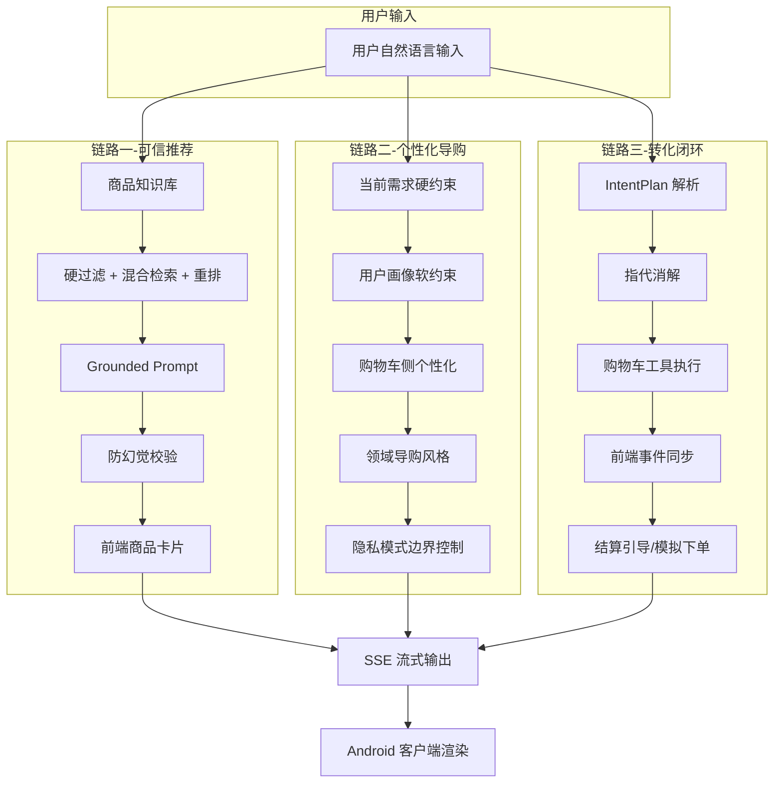

# 基于 RAG 的多模态电商智能导购 AI Agent 技术报告

\xf{
    当前结构是：背景 → 架构 → 核心链路 → 状态管理 → 亮点 → 接口 → 测试 → 总结。 核心设计和突出创新点的位置太靠后了。
    “项目背景与需求分析”作为Introduction，应该要把系统整体架构、核心贡献、与普通RAG-Agent的区别进行总结性说明。
    可参考补充的描述：  
## MAS-to-SAS Skill-Compiled Shopping Agent

传统多智能体导购系统通常会将意图识别、检索规划、记忆分析、商品比较、购物车操作和回复生成拆成多个 LLM Agent 协同完成。这种 MAS 架构虽然模块清晰，但会带来多轮 Agent 通信、重复上下文传递、API 延迟高和 token 消耗大的问题。

本系统采用 MAS-to-SAS compilation 思想，将多 Agent 协作流程压缩为一个带有 skill library 的中心导购 Agent，将系统定义为三个层级：
1. **Skill Library Layer**：将原本分散在多个 Agent 中的能力编译为结构化 skills，包括 query understanding、intent planning、dialogue state tracking、RAG evidence reasoning、memory reasoning、cart action planning、response generation 和 frontend action planning。中心 Agent 在一次 LLM 调用中完成复杂语义理解和结构化计划
2. **Deterministic Tool Layer**：后端调用确定性 tools 完成商品检索、约束过滤、召回重排、购物车 CRUD、memory与对话状态修改、输出校验和前端事件结构化封装。
3. **Validation Layer**：将商品库定义为 Agent 的事实边界，确保动作真实可执行、系统操作由后端工具执行、用户意图在前端全部体现、后端开发与运行痕迹与前端隔离，避免幻觉、虚构或错误业务动作。

这种设计保留了 MAS 的模块化能力边界，但避免了多个 LLM Agent 串行通信带来的延迟和上下文浪费。对于简单请求，系统可由本地模板和工具快速完成；对于复杂、多意图、多轮上下文依赖的请求，Doubao 输出结构化 IntentPlan，后端按 action sequence 执行，并对所有结果做 deterministic validation。

## 分层个性化与隐私控制

系统的个性化不是简单地few-shot prompt构造，而是采用分层机制：当前轮需求是硬约束，用户画像、相似用户协同过滤、领域导购风格和购物车侧个性化都是软约束。当前轮明确预算、类目、品牌和否定条件必须优先执行，历史偏好只能影响排序、解释重点和回复风格，不能覆盖用户本轮要求。

同时，系统支持 full、semantic、off 三种隐私模式。full 模式允许使用画像摘要和历史证据；semantic 模式只使用结构化语义计数，不使用历史自然语言原文；off 模式完全关闭个性化，只依据当前需求推荐。这样既能展示个性化导购能力，也能体现隐私保护下的可控推荐设计。

## 三层Robustness防护

系统在检索无结果、用户需求超出可用商品、模块工作异常等情况下不会直接失败，而是通过渐进式检索放宽、导购式备选推荐和全局异常安全网保持稳定输出。系统就主动给出可选方案，引导对话方向的调整和可替代商品内容，而不是消极拒绝。确保系统在任何情况下都能给出恰当回复
}


## 1. 项目背景与需求分析

### 1.1 项目背景

传统电商的商品发现以搜索、筛选和推荐流为主。用户需要自行理解商品参数、比对品牌型号、判断卖点是否适合自身需求。当需求精确时（搜索已知型号的手机），这种模式是高效的；但当需求模糊时——"想买一款适合油皮的洗面奶"或"预算 300 元给女朋友挑个礼物"——传统搜索很难一次性匹配用户的隐含偏好和使用场景，用户往往需要多轮搜索、逐条浏览详情、自行归纳对比，认知成本较高。

大语言模型（LLM）和检索增强生成（RAG）技术的发展，为电商导购提供了从"被动展示"转向"交互式导购"的技术基础。系统不再是单向推送商品，而是与用户通过自然语言持续交互：理解模糊需求、追问关键条件、从商品知识库中检索真实商品，并基于商品事实生成可信赖的推荐回复。用户可以在对话中完成从需求表达到加购下单的完整购买决策。

本项目基于上述思路，设计并实现了一个基于 RAG 的电商智能导购 AI Agent。系统以 FastAPI 后端和 Android 原生客户端为运行载体，以 `ecommerce_agent_dataset` 中的 151 件真实商品数据为知识基础，以 Doubao 大模型为复杂推理引擎，以本地 BGE/text2vec/reranker 模型为检索增强手段，完成从需求理解、商品检索、个性化推荐、多轮对话管理到购物车操作和模拟下单的端到端导购闭环。
\xf{
    本项目设计并实现了一个面向电商导购场景的结构化 AI Agent 系统, 将导购能力拆解为需求理解、流程控制、任务规划、商品检索、约束过滤、记忆管理、个性化建模、工具执行、前端动作生成与多轮对话反馈等多个可控模块，并通过这些模块的协同实现端到端导购闭环。系统以 `ecommerce_agent_dataset` 中经过结构化增强的真实商品数据为事实基础，结合本地 BGE/text2vec/reranker 模型完成商品召回、语义匹配与候选排序；Doubao 大模型仅在受约束的上下文中承担复杂意图计划排列与自然语言表达生成。系统的核心能力来自内部 Agent 架构对“理解—检索—决策—执行—生成—反馈”全过程的精细化组织，个性化推荐、多轮指代解析、商品比较、购物车操作、模拟下单和前端可解释交互等多种导购功能均由后端确定性模块完成，并经过统一校验，保证推荐可信和动作可控。
}

### 1.2 行业痛点与设计回应

| 痛点 | 具体表现 | 本项目的设计回应 |
|------|---------|-------------|
| 用户需求表达模糊 | 用户常用自然语言描述而非精确搜索词 | 意图识别 + IntentPlan 多步规划 + 多轮追问补全 |
| 大模型生成不可控 | LLM 可能凭空编造商品名、价格、功效参数 | Verified product facts 事实隔离 + ResponseValidator 校验 |
| 个性化需求难以用固定规则覆盖 | 同一类商品，不同用户关注维度差异很大 | 五层分层个性化：硬约束/画像软约束/购物车侧/领域风格/隐私控制 |
| 推荐到购买的链路断裂 | 传统 Agent 只能推荐，用户需离开对话去手动加购下单 | 对话式购物车工具调用 + 前端结构化事件同步 + 闭环结算引导 |
| 多轮交互中上下文容易丢失 | 难以处理"第一款""刚才那个""便宜点的"等指代追问 | 事件记忆 + rank_to_sku 映射 + 五层指代消解 |

### 1.3 项目目标

本项目的建设目标可以概括为：设计并实现一个**面向购买转化的、基于 RAG 的个性化电商智能导购 Agent**。它不是一个单纯的商品问答系统，而是一个将推荐、对比、加购、下单串联在对话流中的导购决策辅助系统。系统通过意图理解、硬约束过滤和多维评分实现可靠的商品检索与推荐，通过购物车工具调用、场景化方案和模拟下单把导购从"推荐商品"推进到"促进下单"，通过分层个性化机制使推荐结果贴合不同用户的偏好和购买场景。

---

## 2. 系统总体设计

### 2.1 系统目标与三条核心链路

系统围绕三条核心链路组织全部能力，每一条链路解决一类核心问题：

**链路一：可信推荐链路。** 解决"LLM 如何基于真实商品数据进行推荐，而不是编造商品"的问题。链路为：用户需求 → 商品知识库 → 结构化硬过滤 → 混合检索与重排 → Grounded Prompt 构造 → 防幻觉校验 → 前端商品卡片展示。

**链路二：个性化导购链路。** 解决"同一类目下如何为不同用户推荐不同商品，同时确保当前需求不被历史偏好覆盖"的问题。链路为：当前需求硬约束 → 用户画像软约束 → 购物车侧个性化 → 领域导购风格 → 隐私模式控制。

**链路三：转化业务闭环。** 解决"如何将自然语言导购推进到可执行的购物车操作和下单"的问题。链路为：需求理解 → 推荐/对比/场景方案 → 指代消解 → 加购/修改/删除/查看购物车 → 结算引导/模拟下单 → 前端状态同步。



### 2.2 系统架构

系统采用前后端分离架构，后端内部划分为四个层次：

| 层级 | 主要组成 | 核心职责 |
|------|----------|----------|
| 客户端交互层 | Android App（ChatScreen、ProductDetailScreen、CartScreen） | 用户输入、对话展示、商品卡片渲染、购物车状态展示 |
| 后端服务层 | FastAPI + SSE 流式输出 + REST 接口 | 请求接收、流式响应、商品与购物车基础服务 |
| Agent 编排层 | ShoppingAgent、QueryUnderstandingModule、DialogueFlowController、ActionExecutor、ResponseGenerationModule、ClosingGuide | 意图识别、流程分流、检索调度、工具调用、回复生成、闭环引导 |
| 数据与模型层 | ProductRepository、HybridRetriever、LocalModelManager、DoubaoClient、SessionMemory、UserHistoryStore、RetrievalFallback | 商品数据、混合检索、本地语义模型、LLM 调用、会话记忆、历史持久化、检索容错 |

后端 Agent 编排层是系统的核心。`ShoppingAgent` 作为总入口，注入 23 个协作组件，覆盖输入预处理、意图解析、模型路由、检索调度、个性化上下文构造、购物车执行、回复生成、前端事件构造、历史持久化和画像刷新。一轮对话的主流程为：接收请求后立即输出 progress 事件 → 读取会话状态/用户历史/购物车 → Doubao-first IntentPlan 解析意图 → 流程控制器决定业务路径 → 执行检索或工具操作 → 构造 Grounded Prompt → 生成回复 → 防幻觉校验 → 构造前端事件与数据 → 写入历史与事件记忆 → SSE 输出结果。

### 2.3 功能模块划分

后端核心模块按职责分组：

| 模块 | 主要职责 |
|------|----------|
| API 路由 | `/api/chat/stream`（含图文上传 `/stream/upload`）、商品、购物车、会话调试接口 |
| Agent 编排 | ShoppingAgent 串联全部处理环节 |
| 意图理解 | 三层递进架构（严格模板 → Doubao IntentPlan → 规则降级），支持 18 种意图 |
| 对话流程控制 | DialogueFlowController 将意图映射到 17 种业务流程 |
| 商品检索 | HybridRetriever 七维混合评分 + RetrievalFallback 四级渐进放宽 + ProductPostProcessor |
| 商品服务 | ProductRepository 加载 151 件商品、标准化、构建检索文本和增强标签 |
| 购物车与结算 | ActionExecutor 确定性执行 7 种购物车操作 + OrderService 模拟下单 |
| 闭环引导 | ClosingGuide 加购后温引导结算，含接受/拒绝检测和 2 轮冷却 |
| 会话记忆 | SessionMemory（短期状态 + 事件记忆）+ UserHistoryStore（持久化 + 隐私控制）+ PersonalizationService + CartAwarePersonalization |
| 回复生成 | ResponseGenerationModule + RagPipeline + ResponseValidator 防幻觉校验 |
| 多模态 | MultimodalService（视觉分析 + 图文融合检索 + 视觉商品匹配） |
| SSE 输出 | FrontendEventBuilder（三段式统一输出）+ ProgressEventBuilder（进度提示） |

---

## 3. 核心导购链路设计

### 3.1 商品知识库：Agent 的事实边界

商品知识库是系统可信推荐的根基。它的核心定位不是"商品列表"，而是**Agent 可以引用的事实边界**——LLM 只能基于知识库中存在的商品信息生成推荐理由，知识库中没有的商品字段对 LLM 完全不可见。

系统中 151 件商品覆盖美妆护肤、数码电子、服饰运动、食品饮料四个一级类目。原始 JSON 数据经 `ProductRepository` 标准化后，按 Agent 使用方式组织为四组事实：

**展示事实**（驱动前端渲染）：商品名称、品牌、价格（取多 SKU 最低价）、库存、图片 URL。这些字段直接映射到前端 `ProductCard` 组件，保证用户看到的商品信息来自真实数据。

**过滤事实**（驱动硬过滤）：类目、子类目、价格、品牌。在评分前由 `_hard_filter()` 使用——类目不匹配直接排除，价格越界直接排除，品牌被用户排除的直接排除。这些字段是硬约束，任何个性化信号都不能突破。

**检索事实**（驱动 RAG 召回）：`searchable_text` 字段在加载时由 `_build_searchable_text()` 将商品名、品牌、类目、SKU 属性、卖点摘要、营销描述、FAQ 问答、用户评价全部拼接为单一文本。所有检索路径——关键词命中、字符 n-gram 语义、BGE/text2vec 向量余弦——都在同一份 `searchable_text` 上执行，避免了多字段检索的权重分配问题。

**导购增强事实**（驱动个性化和推荐理由）：标签（`tags`，从文本中自动匹配 40+ 标签词表）、商品亮点（`highlight_short`/`highlight_detail`）、适用场景（`suitable_scenarios`）、目标人群标签（`target_user_tags`）、非标准查询标签（`non_standard_query_tags`）。这些结构化标签在检索的增强评分阶段（`_enhancement_score`）和回复生成阶段参与匹配，帮助系统理解"这款商品适合谁、在什么场景下使用"——例如用户说"通勤穿搭"，系统不仅匹配商品描述中的"通勤"文字，还会匹配标记了 `suitable_scenarios: ["通勤"]` 的商品。

此外，`reviews_summary`（自动聚合平均评分 + 提取好评/差评示例）作为风险字段，在 Prompt 中驱动 LLM 主动提示商品缺陷（如"部分用户反馈质地偏厚"），而不是只报喜不报忧。

### 3.2 用户理解与 IntentPlan

电商导购对话中，用户输入是高度自由的中文口语。一句话可能同时包含意图指令、商品类目、预算范围、品牌偏好和否定条件——"2000-4000 元、拍照好的 OPPO 或 vivo 手机，不要小米"——系统需要将其一次性解析为可执行的导购任务。

系统采用**三层递进解析架构**，按开销和精度从低到高排列：

**第一层：严格模板。** 仅处理少数低风险高置信句式（"推荐一款xxx""想要xxx""预算是xxx"），由正则匹配本地完成，零 LLM 开销。遇到任何复杂信号词（"不要""然后再""购物车""对比""同时"）立即拒绝并交给下一层。

**第二层：Doubao IntentPlan（主力层）。** 处理所有自由表达、多动作组合、反选排除和上下文追问。系统将可用类目树、当前会话状态（类目、约束、最近推荐列表、购物车内容）和 6 条执行规则发送给 Doubao，要求输出结构化 `IntentPlan`——包含 `primary_intent`、有序 `steps` 列表以及每步的 `intent`、`source_text`、`target_ref`、`quantity`、`sku_id`、`keep_categories` 等执行参数。关键设计约束：Doubao 只输出计划，购物车和检索等操作由后端代码根据 IntentPlan 的 steps 逐一调度。
\xf{
    突出 LLM 只提供语义理解能力，最终业务动作和状态变化都必须经过后端确定性校验与执行。
}

**第三层：保守规则降级。** Doubao API 不可用时触发，使用信号词组匹配（覆盖 18 种意图的 100+ 信号词）、类目别名映射（100+ 条）、品牌别名和分组表、text2vec 语义分类等本地手段完成意图识别和约束提取，在 `route_source` 中标记降级来源。

所有路径的输出是统一的 `ParsedQuery`，包含意图与计划、类目与约束、操作与指代、场景与用户、上下文状态五个字段组。其中 `IntentPlan` 是核心产出物——它的 `steps` 列表按执行顺序排列，每个 step 带有 `requires_tool` 和 `requires_retrieval` 标志，ShoppingAgent 据此决定调用 ActionExecutor（工具执行）还是 ProductSearchTool（商品检索）。组合意图场景下（如"把第一款加购，然后结算"），多个步骤按顺序执行，前一步结果影响后一步行为。

意图解析完成后，`DialogueFlowController.decide()` 将 IntentPlan 中的主意图映射到 17 种业务流程之一——推荐、筛选、细化、对比、详情、场景方案、购物车操作、结算、澄清、闲聊、越界等——再交由 ShoppingAgent 的主分支执行对应处理路径。

### 3.3 商品检索、重排与容错

检索模块的核心任务是：在 151 件商品中，找到同时满足用户硬约束且在语义上与需求最匹配的候选商品。

检索流程分为三步。第一步**硬过滤**：在评分前直接以类目、子类目、价格、品牌、否定约束为条件排除不合格商品。否定约束含安全词判断——例如用户要求"不要酒精"，但商品描述写有"不含酒精"，该商品不会被误排。被排除的商品标记 `filtered_out=True` 并保留在后段，以备后续放宽条件时重新启用。

第二步**多维评分**：每个商品独立计算七个维度的分数——关键词命中率（精确匹配）、字符 n-gram 语义相似度（无模型兜底）、BGE/text2vec 双向量余弦相似度（深层语义）、约束匹配分、商品增强标签匹配分（利用 3.1 节所述的适用场景/人群标签/非标准查询标签进行语义增强）、价格适配分、长期偏好分。当 reranker 可用时再加入交叉编码器重排序分。七个维度的信号互补，任一层不可用时其余层仍可独立工作。

第三步**后处理**：`ProductPostProcessor.finalize()` 按 `product_id` 去重（保留最高分）、二次校验类目/子类目/价格/品牌/否定约束、检测 `violated_constraints` 并排除，按分数排序取前 N 个（推荐取 3 个，对比取 5 个）。`build_product_cards()` 将候选转化为前端可渲染的 `ProductCard` 对象并生成推荐理由——高匹配商品生成正向推荐句，低匹配商品生成诚实提示句（"匹配度一般，作为备选"）。

**购物车侧重排。** 在检索完成之后、后处理之前，`CartAwarePersonalization.rerank()` 根据购物车中同类商品的品牌、子类目和标签，对候选商品进行加分重排。例如购物车有 MacBook 时，推荐耳机/平板会获得 +0.08 品牌搭配分；购物车有精华时，推荐同品牌面霜/眼霜获得 +0.12 子类搭配分。重排仅限同类目生效，购物车只有美妆商品时不影响数码类推荐。

**检索容错。** 当严格检索返回空时，`RetrievalFallback.progressive_retrieve()` 执行四级渐进放宽：放宽价格约束 → 放宽子类目约束 → 移除否定硬过滤 → 全库存关键词匹配。每步放宽容错记录在 `FallbackResult` 中，供回复生成时向用户诚实说明差异。这一设计确保"无精确匹配"也不会中断导购链路——用户总是能获得相近的真实备选和明确的差异说明。

### 3.4 回复生成与防幻觉

检索返回的候选商品集只是一组带评分的结构化数据，距离用户可读的导购回复还需要经过四阶段流水线。

**第一阶段——后处理**（3.3 节已述）：去重、二次过滤、排序、生成商品卡片和推荐理由。

**第二阶段——事实提取**：`RagPipeline` 通过 `KnowledgeFormatter` 从候选商品的 `rag_knowledge`、`reviews_summary`、`tags`、`spotlight` 中提取关键信息，格式化为 "Verified product facts" 文本块——只传递商品名称、价格、卖点摘要和关键评价，避免完整 JSON 撑大 Prompt。未检索到的商品字段对 LLM 完全不可见，从数据层面限制幻觉空间。

**第三阶段——生成**：`ResponseGenerationModule.generate()` 根据当前业务流程选择不同策略。购物车/结算类直接回传工具执行结果（LLM 零参与）；偏好更新/澄清/闲聊/越界使用本地模板；推荐/对比/场景方案等需要自然表达的流程，先构造本地模板作为兜底，再根据 ModelRouter 决策决定是否调用 LLM 润色。每次 LLM 调用前后记录 `last_llm_called` 状态。

**第四阶段——校验**：`ResponseValidator.validate_with_result()` 将 LLM 回复中出现的商品名和价格数字与候选商品列表比对。检测到不在列表中的商品名或与候选价格差异过大的价格数字时，自动回退到本地 Grounded 模板，标记 `repaired=True`。

**Prompt 构造策略**遵循"流程分流、模板兜底、事实约束"原则。所有需要 LLM 参与的流程共享一套基础 Prompt（系统角色 + 用户需求 + 当前类目 + 活跃约束 + 用户偏好摘要 + 候选商品列表 + Verified product facts），不同流程在此基础上追加场景信息（无结果时追加备选引导话术，对比时追加结构化对比草稿，场景方案时追加拆解后的 Scene Plan）。Prompt 中明确规定：只能基于 Verified product facts 回答；不得编造商品、价格、品牌、库存、功效或参数；当前用户明确需求优先于长期偏好；低匹配商品必须诚实说明。

---

## 4. Agent 状态管理与业务执行

### 4.1 多轮上下文与事件记忆

多轮导购中，用户的完整需求是逐步给出的。三轮对话"我想买手机→拍照好一点→不要超过 4000"，应该累积为"智能手机 + 拍照性能 + 价格≤4000"的复合约束，而不是每轮重新理解。系统通过三种记忆类型维持多轮状态，三者在同一轮对话中协同工作。

**短期状态记忆**解决"用户还在不在同一个购物主题下"的问题。`DialogueStateTracking` 维护当前会话的任务级状态——当前意图、流程、购物主题（类目/子类目）、累积的活跃约束（价格/品牌/功能/排除条件）。当用户在同一主题下补充偏好时，系统通过主题锁定判断（检查类目匹配、流程类型和"再""换""便宜""不要"等上下文延续信号），自动将新增条件合并到已累积约束中。如果用户明确切换话题（"我不看手机了，想看看外套"），系统通过跨类目信号检测识别话题切换，不会被旧主题锁定。

**事件记忆**是连接"系统推荐了什么"与"用户指代了什么"的桥梁。它记录推荐、详情查看、商品对比和购物车操作等关键交互，形成可追溯的事件链表。每次推荐事件存储 `rank_to_sku` 映射（"第一款→sku_001、第二款→sku_002 …"），后续详情事件和对比事件通过 `source_event_id` 指向父事件。这一设计意味着用户点击详情页查看某个商品后，之前的推荐排序不会被覆盖——用户追问"把第一个加入购物车"时，系统仍然能从原始推荐事件中取出 rank=1 对应的 sku_id。

**事件记忆最直接的落地效果，就是让用户的口语指代能被稳定解析为确定的商品。** 在多轮对话中，"第一款""第二个""刚才那个""前面比较过的那款""便宜的那个"等指代表达频繁出现。这些表达 LLM 无法可靠解析，因为它们依赖的是系统内部的历史推荐顺序和事件关系，而非语义理解。系统通过事件记忆中的结构化信息逐层定位：

```text
推荐事件 E1:
  rank_to_sku = {1: p_digital_016, 2: p_digital_025, 3: p_digital_013}

对比事件 E2:
  source_event_id = E1
  related_product_ids = [p_digital_016, p_digital_025]

用户下一轮："前面比较过的第一款加入购物车"
  → 定位最近对比事件 E2
  → 沿 source_event_id 回溯到推荐事件 E1
  → 读取 rank_to_sku
  → "第一款" 解析为 p_digital_016
```

解析过程按优先级依次尝试：先查 `rank_to_sku` 映射（"第一个→sku_001"）直接命中；再沿 `source_event_id` 事件链向上追溯（从对比事件回到推荐事件取对应 rank）；然后查 `resolved_references` 字典中已缓存的指代映射；最后走代词识别（"这个""它"→最近事件的第一个关联商品）。对于购物车操作，还支持按价格排序定位（"较贵的""最便宜的"）。五层全部失败则追问用户确认，绝不猜测执行。解析出的确定 `sku_id` 写入 `parsed_query.mentioned_products`，作为后续工具执行的确定性参数。

**长期偏好记忆**维护用户跨会话的稳定购物偏好，持久化在 `storage/user_history/{user_id}/profile.json`，包含画像摘要、结构化画像（说话风格、价格偏好、品牌偏好、排斥条件、决策风格）和语义记忆（类目计数、功能约束计数、价格信号等统计）。长期偏好作为软约束影响推荐排序和话术风格，但绝不覆盖当前轮硬约束——这一点在第 5.1 节中展开。

### 4.2 工具调用与购物车安全执行

系统的一个关键设计原则是：**LLM 负责理解用户表达并输出 IntentPlan，代码负责商品定位、参数校验、业务执行和状态同步。**购物车是确定性业务操作，LLM 绝不直接产生购物车操作的最终参数，更不参与执行。

`ActionExecutor` 是购物车工具的统一入口，支持 7 种操作：加入购物车、删除商品、修改数量、清空购物车、查看购物车、保留指定商品、模拟下单。每种操作遵循统一的安全流程：

1. **商品定位**：利用 4.1 节所述的事件记忆机制，将 IntentPlan 中的口语指代（"第一个""刚才那款"）解析为确定 sku_id；
2. **参数校验**：数量合法性、商品是否存在于商品库、结算前校验购物车非空；
3. **确定性执行**：调用 `CartService` 的对应方法执行购物车 CRUD，每一步返回 `ToolExecutionResult(ok, tool_name, message, payload)`；
4. **状态回传**：执行后立即获取最新购物车快照（含商品名、价格、数量、总价）；
5. **事件写入**：通过 `SessionMemory.record_cart_event()` 将本次操作写入事件记忆——这使得后续轮次可以通过事件链追溯到本次操作的商品。

对于 IntentPlan 中的多步操作（如"把第一个加购，然后下单"），系统按顺序执行每个步骤：前一步加入的 sku_id 被加入保护集合，防止后续步骤误删；任一步失败则后续步骤停止，已执行步骤的效果保留不撤回。

### 4.3 前端事件输出与页面联动

传统导购系统的前端需要从 LLM 回复文本中解析商品 ID、价格、数量等信息，这种方式脆弱且容易出错。本系统的设计是：**前端通过结构化事件驱动页面行为，而非从回复文本中解析数据。**

每轮对话结束时，`FrontendEventBuilder.build()` 输出三段式统一结构：

- **`frontend_events`**：前端动作列表，按步骤顺序执行。包含 `show_reply`（展示回复文本）、`show_products`（展示商品卡片）、`update_cart`（更新购物车状态）、`navigate`（页面跳转）、`show_product_detail`（展示商品详情）、`show_clarification_options`（展示澄清选项）、`show_error`（展示错误提示）等动作类型。每个动作指向 `frontend_data` 中的对应数据字段。

- **`frontend_data`**：结构化数据，包含 `reply_message.text`（回复文本）、`recommended_products.products`（商品卡片数组）、`cart_state.cart`（购物车完整快照）、`navigation.target_page`（跳转目标）、`page_state.cart_badge_count`（角标数量）等。所有数据来自真实商品库和工具执行结果，前端不需要做任何文本解析。

- **`system_debug`**：完整的调试信息——意图解析结果、RAG 检索过程、工具执行记录、模型调用统计、各环节耗时、个性化上下文、隐私设置、事件记忆状态等。这部分仅用于后端调试和验收，不面向普通用户。

关键约束：只有 `frontend_events` 中出现 `navigate` 动作时，前端才跳转页面；其他情况下默认留在聊天页。购物车状态以 `cart_state.cart` 为准，不应从回复文本中解析价格或数量。

此外，`ProgressEventBuilder` 在请求处理的早期即开始推送 `progress` 事件（"正在理解你的需求…""正在商品库中查找…"），使前端在 LLM 调用期间保持有意义的反馈，缩短用户的感知等待时间。

---

## 5. 核心亮点设计

### 5.1 分层个性化导购机制

#### 问题

普通 RAG 导购系统面对"推荐一款洗面奶"时，只能根据当前 query 检索商品并生成固定的推荐回复——不管用户是价格敏感的学生还是有固定品牌偏好的回头客，推荐排序和解释话术几乎相同。问题的根源不在于 LLM 的生成能力不足，而在于系统缺少将用户历史偏好、购物车上下文和当前对话状态有机结合为推荐决策上下文的机制。

具体面临三个挑战：第一，当前需求与历史偏好可能冲突——用户本轮说"预算 2000"，但历史显示通常买高端商品，此时历史偏好不能覆盖当前硬约束；第二，个性化维度因商品领域而异——数码类关注生态相容性，美妆类关注肤质和功效链路，食品类关注口味延续性，单一偏好评分无法覆盖；第三，多轮导购中逐步补充的偏好信息容易丢失。

#### 设计思路

系统将个性化设计为五层分层决策机制，每层有明确的优先级和边界。

**第一层：当前轮需求是硬约束，不可被任何历史信息覆盖。** 用户本轮明确表达的类目、预算、品牌、否定条件，通过 `_hard_filter()` 和 `ProductPostProcessor.finalize()` 两次校验严格执行。即使历史画像显示用户通常购买 5000 元以上的商品，当本轮说"2000 元以内"时，硬过滤严格按 2000 元上限执行。这一层的输入完全来自 `ParsedQuery` 的本轮字段，不引入任何历史数据。

**第二层：用户画像是软约束，影响排序和话术但不改变硬过滤结果。** `PersonalizationService.build_context()` 为每轮回复构造个性化上下文，筛选五类信息：（1）`UserProfileService` 调用 Doubao 分析多轮历史生成的画像摘要和结构化画像；（2）从多轮对话中按类目匹配度和偏好重叠度挑选与当前 query 最相关的历史证据；（3）从历史证据中提取可迁移的回复风格示例；（4）相似购买场景的通用偏好参考；（5）基于 text2vec/BGE 语义相似度的协同过滤——匹配历史用户的回复节奏和解释重点，但不复制原句、不暴露相似用户身份。这些信息打包为 `personalization_context`，在 Prompt 中被明确标记为"软参考，不可覆盖当前明确需求"。

**第三层：购物车侧个性化，利用已选商品推断生态偏好和价格带。** `CartAwarePersonalization` 独立于用户画像运行——即使新用户没有任何历史，只要购物车非空就能从中提取偏好信号。系统对购物车商品按品牌组合、类目/子类目组合和价格分布推导 12 个画像标签（如"Apple 生态""成分党""运动训练""高端消费"），匹配 60+ 条本地配对规则——覆盖数码（Apple 生态、手机配件生态、电竞外设等）、美妆（精华→面霜/眼霜流程、防晒→修护流程等）、服饰（运动鞋→服饰穿搭、户外装备套装等）、食品（咖啡→零食搭配、运动补给等）和跨类目场景。规则匹配转化为评分加成（品牌搭配 +0.08、子类搭配 +0.12、类目搭配 +0.05），同时根据购物车价格画像调整排序（购物车均价低时低价商品加分，均价高时高价商品加分）。关键约束：购物车侧个性化仅限同类目生效，购物车只有美妆商品时不影响数码推荐。

**第四层：领域导购风格差异化。** 不同商品领域的购买决策逻辑不同。系统根据当前推荐类目切换导购风格——数码电子"清晰理性，先给预算内结论，再讲核心参数和短板"；美妆护肤"温柔细腻，优先说肤质/质地/成分或妆效"，禁止承诺医学疗效；服饰运动"场景感强，优先说版型/材质/舒适度/搭配场景"；食品饮料"轻松亲切，优先说口味/甜度/规格/价格/分享场景"，儿童场景禁止推荐含咖啡因/高糖商品。风格差异仅影响表达方式和解释重点，不改变商品事实。

**第五层：隐私控制作为个性化机制的边界开关。** 系统支持三种隐私模式，由 `UserHistoryStore.apply_privacy_preferences()` 解析用户自然语言指令（"关闭个性化""只用语义向量"等）切换：**full**——使用画像摘要、历史原文 few-shot、协同过滤，完整记录对话历史；**semantic**——只使用结构化偏好计数，不使用历史自然语言原文；**off**——不注入任何画像和历史信息，回复完全基于当前轮需求。隐私切换即时生效，系统必须在不依赖任何历史数据的情况下仍能正常完成导购任务——个性化是增强，不是依赖。

#### 作用效果

五层机制的核心价值在于分层独立、边界清晰。硬约束在最底层严格过滤不可突破；画像和购物车上下文作为软约束通过权重控制影响力；领域风格和协同过滤只在表达层面发挥作用；隐私开关在一至四层同时生效。新用户即使没有历史，购物车侧个性化仍能工作；用户关闭个性化后，系统仍能完成基础导购；历史偏好与当前需求矛盾时，当前需求始终优先。

### 5.2 转化导向的业务闭环设计

#### 问题

传统导购 Agent 通常止步于推荐——用户拿到推荐结果后，需要跳出对话、切换到购物车页面、手动搜索并操作。这种断裂导致两个问题：一是操作步骤增加，对话中建立的指代关系（"第一款""刚才那个"）在离开对话界面后全部丢失；二是即使 Agent 支持购物车指令，系统往往让 LLM 直接决定操作参数，而 LLM 在指代消解上天然存在不确定性，将其用于确定性业务操作存在安全风险。

#### 设计思路

转化闭环的核心原则是：**LLM 负责理解用户表达和生成导购话术，代码负责商品检索、指代消解、工具执行、状态同步和安全校验。**系统将需求理解、商品推荐、决策辅助、行动执行、状态同步和结算引导六个环节串联为完整的购买链路。

围绕这条链路做了三个关键设计决策。第一，**意图解析与执行分离**——Doubao 输出 IntentPlan 描述"要做什么"，但 sku_id 确定、参数校验、购物车 CRUD 全部由代码执行。第二，**前端通过结构化事件驱动**——`frontend_events` 和 `frontend_data` 分离，前端不解析 LLM 文本。第三，**每步操作可追踪**——购物车操作写入事件记忆，异常不丢失状态。

#### 关键机制

**需求理解与 IntentPlan 解析**：用户输入"把第一个加入购物车，然后帮我找一款键盘"→ IntentPlan 拆解为 [step1: cart_add, step2: recommend] → 系统检测混合意图 → 分别走工具执行和检索链路。

**指代消解**（见 4.1 节）：五层回退机制，解析失败追问用户而非猜测。

**购物车工具执行**：7 种操作（加购/删除/修改/清空/查看/保留/下单），每种操作经过指代消解→参数校验→确定性执行→状态回传→事件记忆写入。多步操作按序执行，前一步加购的 sku_id 被保护防止误删，任一步失败则后续停止。

**前端状态同步**：工具执行后通过 SSE `cart_update` 推送最新购物车状态，`turn_result` 中 `frontend_data.cart_state` 包含完整快照。前端消费 `frontend_events` 中的 `update_cart` 动作同步角标和页面状态。

**闭环结算引导**：用户加购后，`ClosingGuide` 检查四个条件——购物车非空、当前为购物车操作、无新购物需求信号、距上次拒绝已过 2 轮冷却——满足时在回复末尾自然追加引导话术（以导购角色风格，不生硬）。用户接受（"好的""下单吧"）→触发 checkout 生成模拟订单；用户拒绝（"先不结算""再看看"）→记录轮次、进入冷却、回归推荐。关键设计：引导不是系统提示而是导购话术的自然延续，拒绝后冷却不是永久放弃。

#### 作用效果

转化闭环的核心价值：（1）**操作确定性**——LLM 出计划、代码执行，购物车操作零猜测；（2）**状态一致性**——结构化 `frontend_data` 驱动多页面同步，不依赖文本解析；（3）**链路连续性**——需求→推荐→加购→修改→下单→结算引导，对话流和业务流程完全对齐。

### 5.3 多模态图文导购能力

系统后端已完整实现图片输入和图文融合检索能力。用户可通过 `POST /api/chat/stream/upload` 接口以 multipart/form-data 格式上传图片（支持 8MB 以内），`MultimodalService` 执行以下流程：

1. **视觉理解**：`VisionAnalyzer` 调用 Doubao 视觉模型分析图片内容，提取商品类别、品牌线索、颜色、款式、材质、使用场景等结构化描述；
2. **图文融合查询**：`VisualQueryBuilder` 将视觉分析结果与用户文本（如有）融合，生成增强的检索 query，同时映射到系统商品类目树；
3. **视觉商品匹配**：`VisualProductMatcher` 基于视觉特征在商品库中匹配最相似商品；
4. **候选增强**：视觉匹配结果作为额外信号参与候选商品排序。

Android 客户端 `ImageSearchScreen` 文件已存在于工程目录中，但尚未纳入导航主流程。当前多模态能力后端已完整实现，前端图文入口属于后续扩展。
\xf{
    尚未纳入导航主流程。这些表述最后提交前要删掉。
    AppNavGraph.kt 已接入 Routes.ImageSearch，ChatScreen配置了onImageSearchClick
}

---

## 6. 系统实现与接口说明

### 6.1 后端技术栈

- **框架**：FastAPI + uvicorn，异步 SSE 流式响应
- **大模型**：Doubao-Seed-2.0（通过 API 调用，支持 Mock 模式用于测试）
- **本地模型**：bge-small-zh-v1.5（向量嵌入）、text2vec-base-chinese（语义分类）、bge-reranker-base（重排序），CPU 推理
- **商品数据**：151 件真实商品，JSON 文件组织，内存加载
- **存储**：JSON 文件持久化用户历史（`storage/user_history/`），会话状态内存维护

### 6.2 核心接口

| 接口 | 方法 | 用途 |
|------|------|------|
| `/api/chat/stream` | POST | 主对话流式接口（SSE），支持 `resume` 历史恢复和隐私模式切换 |
| `/api/chat/stream/upload` | POST | 图文融合对话接口（multipart/form-data），支持图片上传 |
| `/api/products?category=&limit=` | GET | 商品列表查询 |
| `/api/products/{sku_id}` | GET | 商品详情查询 |
| `/api/cart/{session_id}` | GET | 查看购物车 |
| `/api/cart/add` | POST | 加入购物车 |
| `/api/cart/remove` | POST | 删除购物车商品 |
| `/api/cart/update` | POST | 修改商品数量 |
| `/api/cart/{session_id}/clear` | POST | 清空购物车 |
| `/api/session/{id}/state` | GET | 调试：查看会话状态 |
| `/api/session/{id}/trace` | GET | 调试：查看执行链路和耗时 |
| `/api/session/{id}/profile` | GET | 调试：查看用户画像 |
| `/health` | GET | 健康检查 |

对话主接口以 SSE 格式推送：`progress`（进度提示）→ `state`（流程预告）→ `token`（文本增量，24 字/chunk）→ `product_cards`/`cart_update`/`product_detail`/`alternatives`/`scenario`（业务事件）→ `frontend_action`（页面跳转决策）→ `turn_result`（统一三段式输出）→ `done`（结束）。

### 6.3 Android 客户端

客户端采用 Kotlin + Jetpack Compose + MVVM 架构。已接入主流程的页面为聊天页（`ChatScreen`）、商品详情页（`ProductDetailScreen`）和购物车页（`CartScreen`）。对话通过 `ChatRepository` 发起 SSE 连接，`ChatViewModel` 管理 `ChatUiState`（消息列表、流式状态、推荐商品、购物车角标），Compose 订阅 `StateFlow` 驱动 UI 响应式更新。商品卡片嵌入对话流，通过 Coil 异步加载图片，点击跳转详情页。`CheckoutScreen`、`OrderResultScreen`、`AddressScreen` 文件已存在但未接入主导航。`ImageSearchScreen` 后端能力已就绪，前端接入待完成。

\xf{
    `AddressScreen` 文件已存在但未接入主导航。提交前要删掉
    当前 AppNavGraph.kt 已接入 checkout/order/address/image 路由
}

---

## 7. 测试与效果验证

### 7.1 测试环境

| 项目 | 说明 |
|------|------|
| 商品数据 | 151 件，4 大类目 |
| 模拟用户 | 26 个预置用户，109+ 会话，800+ 轮对话 |
| 测试方式 | pytest 回归、agent_console 交互式控制台、http_stream_observer 流监控、curl 端到端 |
| 测试图片 | 3 张（手机照片、化妆品照片、街拍全身照） |

\xf{
    “109+”改成150+，或者改成每位用户平均8轮不同需求和对话动作的session
}

### 7.2 基础 RAG 可信推荐测试

| 测试目标 | 用户输入 | 预期行为 | 验收结论 |
|---------|---------|---------|---------|
| 模糊推荐-美妆 | "推荐一款适合干皮的精华液" | 识别类目美妆护肤/精华，推荐 3 款，理由含干皮适配 | 通过 |
| 模糊推荐-数码 | "推荐高性价比蓝牙耳机，300 以内" | 库存无 300 以内耳机，触发渐进容错，展示相近高价备选并说明价格差异 | 通过 |
| 模糊推荐-服饰 | "推荐一双日常通勤穿的跑鞋" | 识别跑步鞋，推荐 3 款，理由体现通勤场景 | 通过 |
| 模糊推荐-食品 | "推荐一款好喝的咖啡" | 识别咖啡类目，推荐 3 款，覆盖速溶和精品 | 通过 |
| 多轮筛选 | T1"轻便跑鞋"→T2"500 以内"→T3"更软一点" | 三轮正确继承类目+价格约束，T3 正确映射"更软→缓震" | 通过 |

### 7.3 分层个性化导购测试

| 测试目标 | 测试方式 | 预期行为 | 验收结论 |
|---------|---------|---------|---------|
| 用户画像个性化 | sophia_digital 老用户恢复，问"适合苹果生态的平板" | 系统读取历史画像（数码用户、Apple 偏好），推荐 iPad，解释关注生态协同 | 通过 |
| 领域风格差异化 | 同一 query"推荐一款好用的"分别对美妆/数码/食品发起 | 美妆回肤质质地，数码回参数短板，食品回口味规格 | 通过 |
| 购物车侧个性化 | digital_tony 购物车有 MacBook 和 iPhone，问"推荐耳机" | Apple 生态规则命中，优先推荐 AirPods 系列 | 通过 |
| 购物车跨类目不干扰 | beauty_lily 购物车只有美妆商品，问"推荐耳机" | 购物车侧个性化不启用（不同类目），正常数码检索 | 通过 |
| 新用户冷启动 | 全新 user_id 首次请求"推荐洗面奶" | 前三轮不启用用户侧个性化，仅使用当前 query 检索 | 通过 |
| 隐私模式关闭 | 输入"关闭个性化"后再问"有什么好用的面霜" | 系统返回纯检索结果，不注入画像和历史信息 | 通过 |
| 隐私模式语义 | 输入"保护隐私但个性化"后再推荐 | 使用结构化偏好计数，不使用历史原文 | 通过 |

### 7.4 转化闭环测试

| 测试目标 | 用户输入序列 | 预期行为 | 验收结论 |
|---------|------------|---------|---------|
| 加购→修改→下单 | "推荐洗面奶"→"第一个加购"→"数量改成2"→"下单吧" | 指代解析正确，数量修改正确，下单生成订单预览 | 通过 |
| 多步组合意图 | "把第一个加购，然后下单" | IntentPlan 拆解为两步，按序执行，加购 sku 保护 | 通过 |
| 关闭引导触发与冷却 | 加购后 → ClosingGuide 引导 → "先不结算" → 继续推荐 | 首次触发引导→用户拒绝→2 轮内不重复引导→后续可重新触发 | 通过 |
| 关闭引导接受 | 加购后 → ClosingGuide 引导 → "好的，下单吧" | 检测接受信号，触发 checkout 流程生成模拟订单 | 通过 |
| 混合意图（加购+推荐） | "把第二个耳机加购，再找一款键盘" | 工具步骤先执行，检索步骤后执行，回复中自然拼接 | 通过 |

### 7.5 检索容错测试

| 测试目标 | 用户输入 | 预期行为 | 验收结论 |
|---------|---------|---------|---------|
| 无结果 fallback | "推荐一款连衣裙，500 以内" | 库中无连衣裙，触发四级渐进放宽，返回真实相近备选（短袖T恤/卫衣等）并说明差异 | 通过 |
| 跨类目切换 | T1"推荐拍照手机"→T2"我不看手机了，看休闲外套" | T2 正确切换到服饰运动，不锁定手机类目 | 通过 |
| 否定约束安全词 | "推荐无酒精的面霜" | 不因"酒精"关键词排除含"不含酒精"描述的商品 | 通过 |

### 7.6 多模态图文匹配测试

| 测试目标 | 测试方式 | 预期行为 | 验收结论 |
|---------|---------|---------|---------|
| 护肤品图片匹配 | 上传化妆品照片 + "帮我看看这张图片里的护肤品" | 视觉分析提取品类线索，匹配到 p_beauty_001（雅诗兰黛小棕瓶） | 通过 |
| 纯图片模式 | 上传照片但不输入文本 | 系统自动补全引导提示，正常执行视觉分析 | 通过 |

### 7.7 多轮指代解析与事件记忆测试

| 测试目标 | 测试序列 | 验收结论 |
|---------|---------|---------|
| 排序指代 | 推荐→"第一个加购"→"第二个详情" | rank_to_sku 命中，指代正确 |
| 跨事件指代 | 推荐→详情→"刚才那款加购" | 事件链追溯，从详情事件回到推荐事件取 rank=1 |
| 对比后指代 | 推荐→"比较前两款"→"第一款加购" | 从对比事件追溯到推荐事件，取 rank=1 |
| 购物车代词 | "把购物车里便宜的那个删掉" | 购物车价格排序定位正确 |

---

## 8. 总结、不足与未来工作

### 8.1 项目总结

本项目设计并实现了一个基于 RAG 的多模态电商智能导购 AI Agent，完成了从 Android 客户端自然语言输入、FastAPI 后端意图解析与流程编排、混合检索与本地模型增强、Doubao LLM 回复生成与校验、SSE 流式返回到商品卡片展示、购物车操作和模拟下单的端到端闭环。系统在以下关键能力上形成了完整实现：

| 能力 | 实现方式 |
|------|---------|
| 可信 RAG 推荐 | 商品知识库事实隔离 + 七维混合检索 + 四级渐进容错 + Verified product facts + ResponseValidator 校验 |
| 意图理解 | 三层递进架构（严格模板 → Doubao IntentPlan → 规则降级），18 种意图 + 多步计划 |
| 分层个性化 | 五层分层机制：硬约束 / 画像软约束 / 购物车侧个性化（60+ 规则） / 领域风格 / 隐私控制（3 模式） |
| 转化闭环 | 六环节链路：IntentPlan → 指代消解 → 工具确定性执行 → 前端事件同步 → ClosingGuide 结算引导（含冷却） |
| 多轮记忆 | DialogueStateTracking + 事件记忆（`rank_to_sku` + 事件链追溯）+ 五层指代消解 |
| 多模态 | 图片上传 + 视觉分析 + 图文融合检索 + 视觉商品匹配 |
| 前端联动 | `frontend_events` + `frontend_data` 结构化驱动 + `progress` 进度提示 |
| 工程可靠性 | 线程隔离 + 每层独立降级 + AgentTrace 全链路追踪 + RuntimeTimer 耗时统计 |

\xf{
    "线程隔离“有点奇怪，需要优化一下。
    可以参考：异步流式输出 + 并行进程事件等待提示 + RuntimeTimer 耗时统计 + AgentTrace 全链路追踪
}

### 8.2 当前不足

| 不足 | 说明 |
|------|------|
| 商品数据规模有限 | 当前 151 件商品覆盖 4 大类目，品类丰富度可大幅扩展 |
| 向量检索为内存实现 | 实时编码 + 内存缓存，未使用 FAISS/Milvus 等持久化向量库 |
| 前端多模态入口未接入 | 后端 `MultimodalService` 已完整实现，Android `ImageSearchScreen` 尚未纳入导航 |
| 下单为模拟流程 | 未接入真实支付、物流系统，订单为 Demo 预览 |
| 缺少行为反馈闭环 | 用户点击/加购/转化行为未回传后端用于画像更新和推荐效果优化 |
| 语音输入未实现 | 语音→文本→Agent 管道未建立 |

\xf{
    不足不要列表格，或者不要写成是功能未实现
    要总结成客观限制（例如商品规模有限） + 缺少实践反馈（测试缺乏、系统承载能力未测试）。例：
        当前 Demo 受数据规模限制；
        缺少真实线上用户反馈；
        并发和承载能力尚未经过生产级压测；
        真实支付、物流、优惠券等业务系统不属于当前赛题重点；
        后续可扩展方向清晰。
}

### 8.3 未来工作

未来工作围绕三个方向展开：

**检索与知识库升级**：引入 FAISS/Milvus 向量库支持更大规模商品数据，拆分为多字段 embedding，增加跨类目预算分配策略。

**多模态与交互扩展**：完成 Android 端图文入口接入，补充语音输入管道，支持多图对比和穿搭场景的多商品同框识别。

**个性化与业务闭环增强**：接入前端埋点回传构建点击/加购/转化行为反馈闭环，引入 Learning-to-Rank 模型，接入真实订单和支付系统，支持优惠券和满减规则。

后续系统将继续围绕**"可信、个性化、可执行"**三个方向迭代，使 AI 导购从 Demo 验证阶段进一步演进为面向真实电商转化场景的智能购物助手。
